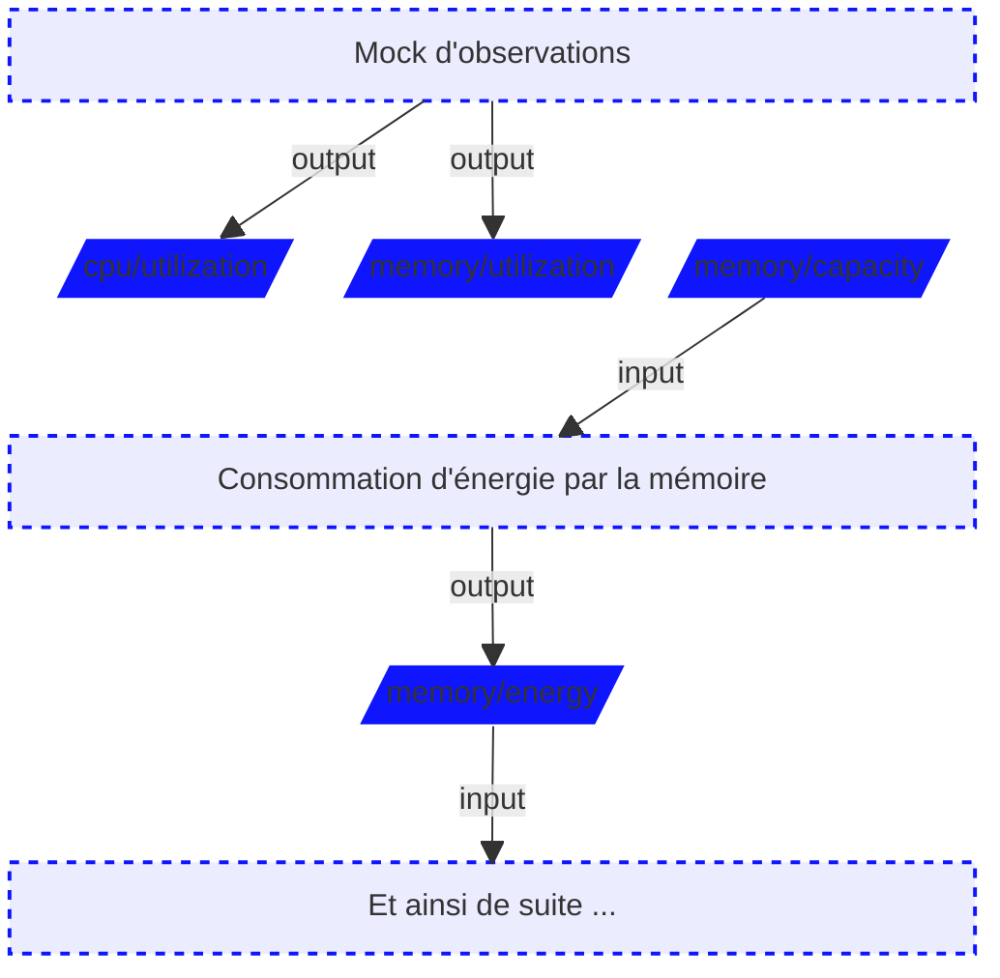

# Markdown Slide Authoring Implementation Plan

> **For agentic workers:** REQUIRED SUB-SKILL: Use superpowers:subagent-driven-development (recommended) or superpowers:executing-plans to implement this plan task-by-task. Steps use checkbox (`- [ ]`) syntax for tracking.

**Goal:** Let demoit slides be written in Markdown — frontmatter, `:::` directives and embedded overridable HTML layouts — instead of raw HTML, and convert `impact-framework/demoit.html` to it with an identical rendering.

**Architecture:** A new pure-Go package `deck/` sits behind `readSteps`, the single deck reader of the repo. It cuts the deck file into slides on fence-aware `---` lines, parses each slide's YAML frontmatter, renders the body with goldmark (plus a hand-written block-directive extension), then runs the result through a Go HTML template layout resolved from the talk's `.demoit/layouts/` or from layouts embedded with `go:embed`. Chroma helpers move out of `handlers/code.go` into a shared `highlight/` package. `.html` decks keep working exactly as before.

**Tech Stack:** Go 1.19, `github.com/yuin/goldmark` v1.7.8, `gopkg.in/yaml.v3` v3.0.1, `github.com/alecthomas/chroma/v2` v2.3.0 (already vendored), `html/template`, `embed`.

**Spec:** `docs/superpowers/specs/2026-09-03-markdown-slides-design.md`

## Global Constraints

- goldmark is pinned to **v1.7.8 exactly**. v1.8.x declares `go 1.22`, while `go.mod` declares `go 1.19` and `Dockerfile:9` pins `golang:1.19.3-alpine3.16`, the image `docker/bake-action` builds with (`.github/workflows/binaries.yml:14`).
- yaml is pinned to `gopkg.in/yaml.v3` **v3.0.1**.
- No other new dependency. No Node toolchain, ever.
- Dependencies are vendored: after **any** change to `go.mod`, run `go mod vendor`.
- Do not change the `go 1.19` directive in `go.mod`, and do not change the `Dockerfile`.
- Every new `.go` file in the engine carries the Apache-2.0 header, copied verbatim from `handlers/step.go:1-17`.
- Test files live in the **external test package** (`package deck_test`, `package directive_test`, `package highlight_test`) — `golangci.yml` enables `testpackage`. Only exported API is testable; design the seams exported.
- Every test calls `t.Parallel()` as its first statement — `golangci.yml` enables `paralleltest`.
- Every comment ends with a period, and every exported symbol has a doc comment starting with its name — `golangci.yml` enables `godot`, `revive` and `stylecheck`.
- No `init()` functions — `golangci.yml` enables `gochecknoinits`.
- Imports are two groups: standard library, then everything else alphabetically, matching `handlers/step.go:19-31`.
- Never modify `.demoit/js/demoit.js` or `.demoit/style.css` in any talk.
- `golangci-lint` and `gofumpt` are **not installed** on this machine. Verification is `gofmt -l .` (must print nothing), `go vet ./...` and `go test ./...`. If `golangci-lint` is available, `golangci-lint run -c golangci.yml` is a bonus; note that the config lists linters (`deadcode`, `structcheck`, `varcheck`, `ifshort`, `exportloopref`) removed from recent golangci-lint releases, so a failure naming those is pre-existing and not yours.
- `go build ./...` prints cgo deprecation warnings from `github.com/rjeczalik/notify` on macOS. Pre-existing; ignore.

---

### Task 1: Vendor goldmark and yaml.v3

**Files:**
- Modify: `go.mod`
- Modify: `go.sum`
- Create: `vendor/github.com/yuin/goldmark/**`
- Create: `vendor/gopkg.in/yaml.v3/**`
- Modify: `vendor/modules.txt`

**Interfaces:**
- Consumes: nothing.
- Produces: `github.com/yuin/goldmark` v1.7.8 and `gopkg.in/yaml.v3` v3.0.1, importable and vendored.

- [ ] **Step 1: Add the two dependencies at their pinned versions**

```bash
go get github.com/yuin/goldmark@v1.7.8
go get gopkg.in/yaml.v3@v3.0.1
```

- [ ] **Step 2: Verify the go directive was not bumped**

Run: `grep '^go ' go.mod`
Expected: `go 1.19`

If it changed, restore it to `go 1.19` before continuing — the Dockerfile builds with Go 1.19.3.

- [ ] **Step 3: Vendor them**

```bash
go mod vendor
```

- [ ] **Step 4: Verify the build still works and the versions are the pinned ones**

```bash
go build ./... && grep -E 'yuin/goldmark|yaml.v3' vendor/modules.txt
```
Expected: build succeeds; `# github.com/yuin/goldmark v1.7.8` and `# gopkg.in/yaml.v3 v3.0.1`

- [ ] **Step 5: Commit**

```bash
git add go.mod go.sum vendor
git commit -m "build: vendor goldmark v1.7.8 and yaml.v3 v3.0.1"
```

---

### Task 2: Extract the chroma helpers into a shared `highlight` package

`deck` cannot import `handlers` — `handlers` will import `deck`, which would be an import cycle. The three chroma helpers `handlers/code.go` already has are moved into a new root package, so `/sourceCode` and Markdown code fences highlight through the same code.

**Files:**
- Create: `highlight/highlight.go`
- Modify: `handlers/code.go`
- Test: `highlight/highlight_test.go`

**Interfaces:**
- Consumes: nothing.
- Produces:
  - `highlight.ForFile(file string) chroma.Lexer`
  - `highlight.ForLanguage(language string) chroma.Lexer`
  - `highlight.Style(name string) *chroma.Style`
  - `highlight.Write(w io.Writer, code, language string) error`

- [ ] **Step 1: Write the failing test**

Create `highlight/highlight_test.go`:

```go
package highlight_test

import (
	"strings"
	"testing"

	"github.com/dgageot/demoit/highlight"
)

func TestForLanguageKnowsYAML(t *testing.T) {
	t.Parallel()

	if got := highlight.ForLanguage("yaml"); got == nil {
		t.Fatal("got no lexer for yaml, want one")
	}
}

func TestForLanguageFallsBackOnUnknownLanguage(t *testing.T) {
	t.Parallel()

	if got := highlight.ForLanguage("not-a-language"); got == nil {
		t.Fatal("got no lexer for an unknown language, want the fallback lexer")
	}
}

func TestStyleDefaultsToGitHub(t *testing.T) {
	t.Parallel()

	if got := highlight.Style("").Name; got != "github" {
		t.Fatalf("got style %q, want github", got)
	}
}

func TestWriteHighlightsInline(t *testing.T) {
	t.Parallel()

	var out strings.Builder
	if err := highlight.Write(&out, "name: demoit\n", "yaml"); err != nil {
		t.Fatalf("got error %v, want none", err)
	}

	got := out.String()
	if !strings.Contains(got, "demoit") {
		t.Fatalf("got %q, want it to contain the highlighted code", got)
	}
	if strings.Contains(got, "<html") {
		t.Fatalf("got %q, want inline HTML with no standalone document", got)
	}
	if strings.Contains(got, "class=") {
		t.Fatalf("got %q, want inline style attributes rather than CSS classes", got)
	}
}
```

- [ ] **Step 2: Run the test to verify it fails**

Run: `go test ./highlight/`
Expected: FAIL — `no required module provides package github.com/dgageot/demoit/highlight`

- [ ] **Step 3: Write the implementation**

Create `highlight/highlight.go`. The Apache-2.0 header is the one from `handlers/step.go:1-17`. `nonDefaultYAMLLexer`, `ForFile` and `Style` are moved verbatim from `handlers/code.go` (respectively lines 70-100, 105-116 and 118-127) — do not change their behaviour, including the `lexers.Get(".yaml")` lookup and the `fmt.Println` it does.

```go
/*
Copyright 2018 Google LLC
Copyright 2022 David Gageot

Licensed under the Apache License, Version 2.0 (the "License");
you may not use this file except in compliance with the License.
You may obtain a copy of the License at

    http://www.apache.org/licenses/LICENSE-2.0

Unless required by applicable law or agreed to in writing, software
distributed under the License is distributed on an "AS IS" BASIS,
WITHOUT WARRANTIES OR CONDITIONS OF ANY KIND, either express or implied.
See the License for the specific language governing permissions and
limitations under the License.
*/

// Package highlight wraps chroma so that source files served by /sourceCode
// and Markdown code fences are highlighted by the same code.
package highlight

import (
	"fmt"
	"io"
	"strings"

	"github.com/alecthomas/chroma/v2"
	chromahtml "github.com/alecthomas/chroma/v2/formatters/html"
	"github.com/alecthomas/chroma/v2/lexers"
	"github.com/alecthomas/chroma/v2/styles"
)

// nonDefaultYAMLLexer turns bare YAML scalars into single-quoted string
// tokens, so that values stand out from keys.
type nonDefaultYAMLLexer struct {
	chroma.Lexer
}

// Tokenise implements chroma.Lexer.
func (n *nonDefaultYAMLLexer) Tokenise(options *chroma.TokeniseOptions, text string) (chroma.Iterator, error) {
	iterator, err := n.Lexer.Tokenise(nil, text)
	if err != nil {
		return nil, err
	}

	updated := iterator.Tokens()

	for i, token := range updated {
		if token.Type == chroma.Text {
			if token.Value == "-" {
				continue
			}

			if i+1 >= len(updated) {
				continue
			}

			next := updated[i+1]
			if next.Type == chroma.Punctuation && next.Value == ":" {
				continue
			}

			token.Type = chroma.LiteralStringSingle
			updated[i] = token
		}
	}

	return chroma.Literator(updated...), nil
}

// ForFile returns the lexer to use for the given file name.
func ForFile(file string) chroma.Lexer {
	if lexer := lexers.Match(file); lexer != nil {
		if strings.HasSuffix(file, ".yaml") || strings.HasSuffix(file, ".yml") {
			fmt.Println("Using non default YAML Lexer")
			return &nonDefaultYAMLLexer{lexers.Get(".yaml")}
		}
		return lexer
	}

	return lexers.Fallback
}

// ForLanguage returns the lexer to use for the language of a Markdown code
// fence. An unknown language yields the fallback lexer.
func ForLanguage(language string) chroma.Lexer {
	if language == "yaml" || language == "yml" {
		if lexer := lexers.Get("yaml"); lexer != nil {
			return &nonDefaultYAMLLexer{lexer}
		}
	}

	if lexer := lexers.Get(language); lexer != nil {
		return lexer
	}

	return lexers.Fallback
}

// Style returns the chroma style with the given name, GitHub by default.
func Style(name string) *chroma.Style {
	if name != "" {
		style := styles.Get(name)
		if style != nil {
			return style
		}
	}

	return styles.GitHub
}

// Write writes code as HTML highlighted for the given language, with inline
// style attributes so that a slide needs no extra stylesheet.
func Write(w io.Writer, code, language string) error {
	iterator, err := ForLanguage(language).Tokenise(nil, code)
	if err != nil {
		return err
	}

	formatter := chromahtml.New(chromahtml.WithClasses(false))

	return formatter.Format(w, Style(""), iterator)
}
```

- [ ] **Step 4: Run the test to verify it passes**

Run: `go test ./highlight/`
Expected: PASS

- [ ] **Step 5: Make `handlers/code.go` use the new package**

In `handlers/code.go`, delete `nonDefaultYAMLLexer` (lines 70-100), `lexer` (105-116) and `style` (118-127), then change the two call sites in `Code`:

```go
	lexer := highlight.ForFile(filename)
	style := highlight.Style(r.FormValue("style"))
```

Fix the import block: drop `github.com/alecthomas/chroma/v2`, `github.com/alecthomas/chroma/v2/lexers` and `github.com/alecthomas/chroma/v2/styles`, keep `github.com/alecthomas/chroma/v2/formatters/html`, and add `github.com/dgageot/demoit/highlight`. `strings` is still used by `Code`; `fmt` and `strconv` are still used too.

- [ ] **Step 6: Verify the whole build and the format**

```bash
go build ./... && go vet ./... && gofmt -l .
```
Expected: no error, and `gofmt -l .` prints nothing.

- [ ] **Step 7: Commit**

```bash
git add highlight handlers/code.go
git commit -m "refactor: extract chroma helpers into highlight package"
```

---

### Task 3: Cut a deck file into slides, fence-aware, with frontmatter

**Files:**
- Create: `deck/split.go`
- Test: `deck/split_test.go`

**Interfaces:**
- Consumes: nothing.
- Produces:
  - `type deck.RawSlide struct { Frontmatter []byte; Body []byte; StartLine int; BodyLine int }`
  - `func deck.Split(src []byte) []RawSlide`

- [ ] **Step 1: Write the failing test**

Create `deck/split_test.go`:

```go
package deck_test

import (
	"testing"

	"github.com/dgageot/demoit/deck"
)

func TestSplitReadsFrontmatterAndBody(t *testing.T) {
	t.Parallel()

	src := []byte("---\nlayout: cover\n---\n# Un\n\n---\n# Deux\n")

	slides := deck.Split(src)

	if len(slides) != 2 {
		t.Fatalf("got %d slides, want 2", len(slides))
	}
	if got, want := string(slides[0].Frontmatter), "layout: cover\n"; got != want {
		t.Errorf("got frontmatter %q, want %q", got, want)
	}
	if got, want := string(slides[0].Body), "# Un\n\n"; got != want {
		t.Errorf("got body %q, want %q", got, want)
	}
	if got, want := slides[0].BodyLine, 4; got != want {
		t.Errorf("got body line %d, want %d", got, want)
	}
	if got, want := slides[1].StartLine, 7; got != want {
		t.Errorf("got start line %d, want %d", got, want)
	}
	if slides[1].Frontmatter != nil {
		t.Errorf("got frontmatter %q on a slide without one, want none", slides[1].Frontmatter)
	}
}

func TestSplitIgnoresSeparatorsInsideAFence(t *testing.T) {
	t.Parallel()

	src := []byte("```mermaid\n---\ntitle: diagramme\n---\nflowchart LR\n```\n")

	slides := deck.Split(src)

	if len(slides) != 1 {
		t.Fatalf("got %d slides, want 1 — a --- inside a code fence must not cut", len(slides))
	}
}

func TestSplitIgnoresSeparatorsInsideAYAMLFence(t *testing.T) {
	t.Parallel()

	src := []byte("# Un\n\n```yaml\nfoo: 1\n---\nbar: 2\n```\n\n---\n# Deux\n")

	slides := deck.Split(src)

	if len(slides) != 2 {
		t.Fatalf("got %d slides, want 2", len(slides))
	}
}

func TestSplitAcceptsLongerSeparators(t *testing.T) {
	t.Parallel()

	src := []byte("# Un\n\n-----\n# Deux\n")

	slides := deck.Split(src)

	if len(slides) != 2 {
		t.Fatalf("got %d slides, want 2", len(slides))
	}
}
```

- [ ] **Step 2: Run the test to verify it fails**

Run: `go test ./deck/`
Expected: FAIL — `no required module provides package github.com/dgageot/demoit/deck`

- [ ] **Step 3: Write the implementation**

Create `deck/split.go` with the Apache-2.0 header, then:

```go
// Package deck reads a presentation's deck file and renders its slides.
package deck

import "strings"

// RawSlide is one slide of a deck file, before rendering.
type RawSlide struct {
	// Frontmatter is the slide's YAML block, without its --- fences. It is nil
	// when the slide has none.
	Frontmatter []byte
	// Body is everything after the frontmatter.
	Body []byte
	// StartLine is the 1-based line of the slide's first line in the deck file.
	StartLine int
	// BodyLine is the 1-based line of Body's first line in the deck file.
	BodyLine int
}

// Split cuts a deck file into slides. A slide ends at a line of three or more
// dashes that sits outside any code fence and outside the slide's own
// frontmatter. A --- inside a ``` or ~~~ fence never cuts, which is what lets
// a mermaid or YAML block contain one.
func Split(src []byte) []RawSlide {
	lines := splitLines(src)

	var slides []RawSlide
	for i := 0; ; {
		slide, next, more := readSlide(lines, i)
		slides = append(slides, slide)
		if !more {
			return slides
		}
		i = next
	}
}

// readSlide reads one slide starting at lines[start]. It returns the slide, the
// index of the next slide's first line, and whether a separator ended this one.
func readSlide(lines []string, start int) (RawSlide, int, bool) {
	frontmatter, bodyStart := readFrontmatter(lines, start)
	end, more := findSlideEnd(lines, bodyStart)

	return RawSlide{
		Frontmatter: frontmatter,
		Body:        []byte(strings.Join(lines[bodyStart:end], "")),
		StartLine:   start + 1,
		BodyLine:    bodyStart + 1,
	}, end + 1, more
}

// readFrontmatter reads the YAML block at the top of a slide and returns it
// with the index of the slide's first body line. An unterminated block is not
// treated as frontmatter, so its opening line acts as a separator instead.
func readFrontmatter(lines []string, start int) ([]byte, int) {
	i := start
	for i < len(lines) && strings.TrimSpace(lines[i]) == "" {
		i++
	}
	if i >= len(lines) || !isSlideSeparator(lines[i]) {
		return nil, start
	}

	for j := i + 1; j < len(lines); j++ {
		if isSlideSeparator(lines[j]) {
			return []byte(strings.Join(lines[i+1:j], "")), j + 1
		}
	}

	return nil, start
}

// findSlideEnd returns the index of the separator that ends the slide, or
// len(lines) at end of file, and whether a separator was found.
func findSlideEnd(lines []string, start int) (int, bool) {
	fence := ""

	for i := start; i < len(lines); i++ {
		line := strings.TrimRight(lines[i], "\r\n")

		switch {
		case fence != "":
			if isFenceClose(line, fence) {
				fence = ""
			}
		case fenceOpen(line) != "":
			fence = fenceOpen(line)
		case isSlideSeparator(line):
			return i, true
		}
	}

	return len(lines), false
}

// splitLines splits src into lines, each keeping its trailing newline.
func splitLines(src []byte) []string {
	rest := string(src)

	var lines []string
	for len(rest) > 0 {
		i := strings.IndexByte(rest, '\n')
		if i < 0 {
			lines = append(lines, rest)
			break
		}
		lines = append(lines, rest[:i+1])
		rest = rest[i+1:]
	}

	return lines
}

// fenceOpen returns the code fence the line opens, or an empty string when it
// opens none. A line indented by four spaces or more opens nothing.
func fenceOpen(line string) string {
	trimmed := strings.TrimLeft(line, " ")
	if len(line)-len(trimmed) > 3 {
		return ""
	}

	for _, char := range []byte{'`', '~'} {
		if run := runLength(trimmed, char); run >= 3 {
			return trimmed[:run]
		}
	}

	return ""
}

// isFenceClose reports whether the line closes the given code fence.
func isFenceClose(line, fence string) bool {
	trimmed := strings.TrimLeft(line, " ")
	run := runLength(trimmed, fence[0])

	return run >= len(fence) && strings.TrimSpace(trimmed[run:]) == ""
}

// runLength returns the number of leading char bytes of s.
func runLength(s string, char byte) int {
	i := 0
	for i < len(s) && s[i] == char {
		i++
	}

	return i
}

// isSlideSeparator reports whether the line separates two slides.
func isSlideSeparator(line string) bool {
	trimmed := strings.TrimSpace(line)

	return len(trimmed) >= 3 && strings.Trim(trimmed, "-") == ""
}
```

- [ ] **Step 4: Run the test to verify it passes**

Run: `go test ./deck/ -v -run TestSplit`
Expected: PASS, 4 tests

- [ ] **Step 5: Verify the format**

Run: `gofmt -l . && go vet ./deck/`
Expected: no output from either

- [ ] **Step 6: Commit**

```bash
git add deck/split.go deck/split_test.go
git commit -m "feat(deck): cut deck files into slides, fence-aware"
```

---

### Task 4: Read `.demoit/talk.yml`

**Files:**
- Create: `deck/talk.go`
- Test: `deck/talk_test.go`

**Interfaces:**
- Consumes: nothing.
- Produces:
  - `type deck.Talk struct { Title string; Layout string; Logos []string; Footer string }`
  - `func deck.LoadTalk(folder string) (Talk, error)`

- [ ] **Step 1: Write the failing test**

Create `deck/talk_test.go`:

```go
package deck_test

import (
	"os"
	"path/filepath"
	"testing"

	"github.com/dgageot/demoit/deck"
)

// writeTalk writes a .demoit/talk.yml into a fresh folder and returns it.
func writeTalk(t *testing.T, content string) string {
	t.Helper()

	folder := t.TempDir()
	if err := os.MkdirAll(filepath.Join(folder, ".demoit"), 0o755); err != nil {
		t.Fatalf("unable to create .demoit: %v", err)
	}
	if content != "" {
		path := filepath.Join(folder, ".demoit", "talk.yml")
		if err := os.WriteFile(path, []byte(content), 0o600); err != nil {
			t.Fatalf("unable to write talk.yml: %v", err)
		}
	}

	return folder
}

func TestLoadTalkReadsEveryKey(t *testing.T) {
	t.Parallel()

	folder := writeTalk(t, "title: Impact Framework\nlayout: content\nlogos:\n  - /images/a.svg\n  - /images/b.jpg\nfooter: adapted from demoit\n")

	talk, err := deck.LoadTalk(folder)
	if err != nil {
		t.Fatalf("got error %v, want none", err)
	}

	if got, want := talk.Title, "Impact Framework"; got != want {
		t.Errorf("got title %q, want %q", got, want)
	}
	if got, want := talk.Layout, "content"; got != want {
		t.Errorf("got layout %q, want %q", got, want)
	}
	if got, want := len(talk.Logos), 2; got != want {
		t.Errorf("got %d logos, want %d", got, want)
	}
	if got, want := talk.Footer, "adapted from demoit"; got != want {
		t.Errorf("got footer %q, want %q", got, want)
	}
}

func TestLoadTalkAcceptsAMissingFile(t *testing.T) {
	t.Parallel()

	talk, err := deck.LoadTalk(writeTalk(t, ""))
	if err != nil {
		t.Fatalf("got error %v, want none — a talk without talk.yml must work", err)
	}

	if got, want := talk.Layout, "default"; got != want {
		t.Errorf("got layout %q, want %q", got, want)
	}
	if len(talk.Logos) != 0 {
		t.Errorf("got %d logos, want none", len(talk.Logos))
	}
}

func TestLoadTalkRejectsInvalidYAML(t *testing.T) {
	t.Parallel()

	if _, err := deck.LoadTalk(writeTalk(t, "logos: [unterminated\n")); err == nil {
		t.Fatal("got no error, want one for invalid YAML")
	}
}
```

- [ ] **Step 2: Run the test to verify it fails**

Run: `go test ./deck/ -run TestLoadTalk`
Expected: FAIL — `undefined: deck.LoadTalk`

- [ ] **Step 3: Write the implementation**

Create `deck/talk.go` with the Apache-2.0 header, then:

```go
package deck

import (
	"errors"
	"fmt"
	"io/fs"
	"os"
	"path/filepath"

	"gopkg.in/yaml.v3"
)

// Talk is the identity of a presentation, shared by all its localized decks.
// It is read once from <folder>/.demoit/talk.yml and handed to every layout.
type Talk struct {
	// Title is the talk's title, available to layouts that want a fallback
	// when a slide declares none.
	Title string `yaml:"title"`
	// Layout is the layout slides use when they declare none.
	Layout string `yaml:"layout"`
	// Logos are the images the header and cover layouts display, in order.
	Logos []string `yaml:"logos"`
	// Footer is the text layouts may display at the bottom of a slide.
	Footer string `yaml:"footer"`
}

// LoadTalk reads <folder>/.demoit/talk.yml. A missing file is not an error: it
// yields a Talk with the default layout and no logos, so that a talk can
// consist of a single Markdown file.
func LoadTalk(folder string) (Talk, error) {
	talk := Talk{Layout: "default"}

	content, err := os.ReadFile(filepath.Join(folder, ".demoit", "talk.yml"))
	if errors.Is(err, fs.ErrNotExist) {
		return talk, nil
	}
	if err != nil {
		return talk, err
	}

	if err := yaml.Unmarshal(content, &talk); err != nil {
		return talk, fmt.Errorf("unable to parse .demoit/talk.yml: %w", err)
	}

	if talk.Layout == "" {
		talk.Layout = "default"
	}

	return talk, nil
}
```

- [ ] **Step 4: Run the test to verify it passes**

Run: `go test ./deck/ -v -run TestLoadTalk`
Expected: PASS, 3 tests

- [ ] **Step 5: Commit**

```bash
git add deck/talk.go deck/talk_test.go
git commit -m "feat(deck): read .demoit/talk.yml"
```

---

### Task 5: The `:::` / `::` directive extension

The heart of the change. `goldmark-fences` v1.0.0 cannot be reused — its `Open` refuses a fence without a `{` — but its stack-based approach is the model, and its "only the deepest container consumes a closing fence" rule is what makes same-length nesting work even though goldmark calls `Continue` outermost-first (`parser/parser.go:1081-1094`).

**Files:**
- Create: `deck/directive/node.go`
- Create: `deck/directive/parser.go`
- Create: `deck/directive/errors.go`
- Create: `deck/directive/render.go`
- Create: `deck/directive/extension.go`
- Test: `deck/directive/directive_test.go`

**Interfaces:**
- Consumes: goldmark v1.7.8.
- Produces:
  - `type directive.Node struct { ast.BaseBlock; Name string; Attrs map[string]string; FenceLength int; Container bool; Line int }`
  - `var directive.Kind ast.NodeKind`
  - `type directive.Extension struct{}` implementing `goldmark.Extender`
  - `type directive.Error struct { Line int; Message string }` with `Error() string`
  - `func directive.Errors(ctx parser.Context) []Error`

- [ ] **Step 1: Write the failing test**

Create `deck/directive/directive_test.go`:

```go
package directive_test

import (
	"bytes"
	"strings"
	"testing"

	"github.com/dgageot/demoit/deck/directive"
	"github.com/yuin/goldmark"
	"github.com/yuin/goldmark/parser"
	"github.com/yuin/goldmark/renderer/html"
)

// render converts src and returns the HTML plus the directive errors found.
func render(t *testing.T, src string) (string, []directive.Error) {
	t.Helper()

	md := goldmark.New(
		goldmark.WithExtensions(directive.Extension{}),
		goldmark.WithRendererOptions(html.WithUnsafe()),
	)

	ctx := parser.NewContext()

	var out bytes.Buffer
	if err := md.Convert([]byte(src), &out, parser.WithContext(ctx)); err != nil {
		t.Fatalf("got error %v, want none", err)
	}

	return out.String(), directive.Errors(ctx)
}

func TestLeafDirectiveRendersASelfContainedElement(t *testing.T) {
	t.Parallel()

	got, errs := render(t, "::term{path=sandbox}\n")

	if len(errs) != 0 {
		t.Fatalf("got errors %v, want none", errs)
	}
	if want := `<web-term path="sandbox"></web-term>`; !strings.Contains(got, want) {
		t.Fatalf("got %q, want it to contain %q", got, want)
	}
}

func TestContainerDirectiveWrapsItsMarkdownChildren(t *testing.T) {
	t.Parallel()

	got, errs := render(t, ":::speakernotes\nmontrer **if-run**\n:::\n")

	if len(errs) != 0 {
		t.Fatalf("got errors %v, want none", errs)
	}
	if !strings.Contains(got, "<speaker-notes>") || !strings.Contains(got, "</speaker-notes>") {
		t.Fatalf("got %q, want it wrapped in <speaker-notes>", got)
	}
	if !strings.Contains(got, "<strong>if-run</strong>") {
		t.Fatalf("got %q, want the children parsed as Markdown", got)
	}
}

func TestContainersNestWithEqualFenceLengths(t *testing.T) {
	t.Parallel()

	got, errs := render(t, ":::window{title=Terminal}\n:::split\n::term{path=sources}\n:::\n:::\n")

	if len(errs) != 0 {
		t.Fatalf("got errors %v, want none", errs)
	}
	for _, want := range []string{`<fake-window title="Terminal">`, "<split-view>", `<web-term path="sources">`, "</split-view>", "</fake-window>"} {
		if !strings.Contains(got, want) {
			t.Fatalf("got %q, want it to contain %q", got, want)
		}
	}
	if strings.Index(got, "<split-view>") < strings.Index(got, "<fake-window") {
		t.Fatal("got the split before the window, want it nested inside")
	}
}

func TestIndentedContainerContentIsNotACodeBlock(t *testing.T) {
	t.Parallel()

	got, errs := render(t, ":::window{title=Demo}\n  :::split\n    ::term{path=sources}\n  :::\n:::\n")

	if len(errs) != 0 {
		t.Fatalf("got errors %v, want none", errs)
	}
	if strings.Contains(got, "<pre><code>") {
		t.Fatalf("got %q, want the indented content parsed, not turned into a code block", got)
	}
	if !strings.Contains(got, `<web-term path="sources">`) {
		t.Fatalf("got %q, want the nested term rendered", got)
	}
}

func TestUnclosedContainerIsReported(t *testing.T) {
	t.Parallel()

	_, errs := render(t, "# Titre\n\n:::split\n::term{path=sources}\n")

	if len(errs) != 1 {
		t.Fatalf("got %d errors, want 1", len(errs))
	}
	if got, want := errs[0].Line, 3; got != want {
		t.Errorf("got line %d, want %d — the line the container opened on", got, want)
	}
	if !strings.Contains(errs[0].Message, "split") {
		t.Errorf("got message %q, want it to name the split directive", errs[0].Message)
	}
}

func TestSplitCarriesItsHeightAsAClass(t *testing.T) {
	t.Parallel()

	got, errs := render(t, ":::split{height=xlarge}\n::term{path=sources}\n:::\n")

	if len(errs) != 0 {
		t.Fatalf("got errors %v, want none", errs)
	}
	if want := `<split-view class="xlarge-height">`; !strings.Contains(got, want) {
		t.Fatalf("got %q, want it to contain %q", got, want)
	}
}

func TestTwoColonsIsNotADirectiveWithoutAName(t *testing.T) {
	t.Parallel()

	got, _ := render(t, "prose :: prose\n")

	if strings.Contains(got, "<web-term") {
		t.Fatalf("got %q, want no directive", got)
	}
}
```

- [ ] **Step 2: Run the test to verify it fails**

Run: `go test ./deck/directive/`
Expected: FAIL — `no required module provides package github.com/dgageot/demoit/deck/directive`

- [ ] **Step 3: Write the AST node**

Create `deck/directive/node.go` with the Apache-2.0 header, then:

```go
// Package directive adds block directives to goldmark: `:::name{attrs}` for a
// container and `::name{attrs}` for a leaf. Each one renders as the custom
// element the demoit web components define.
package directive

import "github.com/yuin/goldmark/ast"

// Kind is the NodeKind of Node.
var Kind = ast.NewNodeKind("Directive")

// Node is a block directive.
type Node struct {
	ast.BaseBlock

	// Name is the directive name, such as "split", "term" or "code".
	Name string
	// Attrs are the attributes written between braces.
	Attrs map[string]string
	// FenceLength is the number of colons of the opening fence.
	FenceLength int
	// Container reports whether the directive wraps children.
	Container bool
	// Line is the 1-based line the directive opened on, for error messages.
	Line int

	// closed records that a fence closed this container, as opposed to the end
	// of the file.
	closed bool
}

// Kind implements ast.Node.
func (n *Node) Kind() ast.NodeKind {
	return Kind
}

// Dump implements ast.Node.
func (n *Node) Dump(source []byte, level int) {
	ast.DumpHelper(n, source, level, map[string]string{"Name": n.Name}, nil)
}

// NewNode returns a directive node.
func NewNode(name string, attrs map[string]string, fenceLength, line int) *Node {
	return &Node{
		Name:        name,
		Attrs:       attrs,
		FenceLength: fenceLength,
		Container:   fenceLength >= 3,
		Line:        line,
	}
}
```

- [ ] **Step 4: Write the error collection**

Create `deck/directive/errors.go` with the Apache-2.0 header, then:

```go
package directive

import (
	"fmt"

	"github.com/yuin/goldmark/parser"
)

// errorsKey holds the errors collected while parsing one document.
var errorsKey = parser.NewContextKey()

// Error is a problem found in a directive, with the line it was written on.
type Error struct {
	// Line is the 1-based line in the deck file.
	Line int
	// Message says what is wrong.
	Message string
}

// Error implements the error interface.
func (e Error) Error() string {
	return fmt.Sprintf("line %d: %s", e.Line, e.Message)
}

// Errors returns the directive errors collected while parsing with ctx.
func Errors(ctx parser.Context) []Error {
	collected, ok := ctx.Get(errorsKey).([]Error)
	if !ok {
		return nil
	}

	return collected
}

// addError records a directive error into ctx.
func addError(ctx parser.Context, line int, format string, args ...any) {
	collected, _ := ctx.Get(errorsKey).([]Error)
	ctx.Set(errorsKey, append(collected, Error{
		Line:    line,
		Message: fmt.Sprintf(format, args...),
	}))
}
```

- [ ] **Step 5: Write the block parser**

Create `deck/directive/parser.go` with the Apache-2.0 header, then:

```go
package directive

import (
	"github.com/yuin/goldmark/ast"
	"github.com/yuin/goldmark/parser"
	"github.com/yuin/goldmark/text"
	"github.com/yuin/goldmark/util"
)

// stackKey holds the containers open at the current point of the document.
var stackKey = parser.NewContextKey()

// openContainer is one entry of the stack of open containers.
type openContainer struct {
	node *Node
	// contentIndent is the indentation of the container's first non-blank
	// content line, stripped from every following line so that nesting can be
	// indented without turning into a Markdown code block.
	contentIndent int
	// contentStarted records that contentIndent has been measured.
	contentStarted bool
}

// blockParser parses `:::name{attrs}` containers and `::name{attrs}` leaves.
type blockParser struct{}

// NewParser returns the block parser of the directive extension.
func NewParser() parser.BlockParser {
	return &blockParser{}
}

// Trigger implements parser.BlockParser.
func (b *blockParser) Trigger() []byte {
	return []byte{':'}
}

// Open implements parser.BlockParser.
func (b *blockParser) Open(_ ast.Node, reader text.Reader, pc parser.Context) (ast.Node, parser.State) {
	line, _ := reader.PeekLine()
	pos := pc.BlockOffset()
	if pos < 0 || line[pos] != ':' {
		return nil, parser.NoChildren
	}

	end := pos
	for ; end < len(line) && line[end] == ':'; end++ {
	}
	fenceLength := end - pos
	if fenceLength < 2 {
		return nil, parser.NoChildren
	}

	nameEnd := end
	for ; nameEnd < len(line) && isNameByte(line[nameEnd]); nameEnd++ {
	}
	name := string(line[end:nameEnd])
	if name == "" {
		return nil, parser.NoChildren
	}

	lineNumber, _ := reader.Position()
	reader.Advance(nameEnd)

	node := NewNode(name, readAttributes(reader), fenceLength, lineNumber+1)
	if !node.Container {
		return node, parser.NoChildren
	}

	push(pc, node)

	return node, parser.HasChildren
}

// Continue implements parser.BlockParser.
func (b *blockParser) Continue(node ast.Node, reader text.Reader, pc parser.Context) parser.State {
	directiveNode, ok := node.(*Node)
	if !ok {
		return parser.Close
	}

	stack := containers(pc)
	depth := indexOf(stack, directiveNode)
	if depth < 0 {
		return parser.Close
	}

	line, segment := reader.PeekLine()
	width, pos := util.IndentWidth(line, reader.LineOffset())

	if !stack[depth].contentStarted && !util.IsBlank(line[pos:]) {
		stack[depth].contentStarted = true
		stack[depth].contentIndent = width
		pc.Set(stackKey, stack)
	}

	// Only the deepest open container consumes a closing fence: goldmark calls
	// Continue from the outermost container inwards, so an outer container must
	// leave the line to its children.
	if depth == len(stack)-1 && isClosingFence(line, pos, directiveNode.FenceLength) {
		directiveNode.closed = true
		pc.Set(stackKey, stack[:depth])
		reader.Advance(segment.Stop - segment.Start - trailingNewline(line) + segment.Padding)

		return parser.Close
	}

	if indent := stack[depth].contentIndent; indent > 0 {
		if limit := segment.Stop - segment.Start - 1; indent > limit {
			indent = limit
		}
		if indent > 0 {
			reader.Advance(indent)
		}
	}

	return parser.Continue | parser.HasChildren
}

// Close implements parser.BlockParser.
func (b *blockParser) Close(node ast.Node, _ text.Reader, pc parser.Context) {
	directiveNode, ok := node.(*Node)
	if !ok {
		return
	}

	if stack := containers(pc); indexOf(stack, directiveNode) >= 0 {
		pc.Set(stackKey, stack[:indexOf(stack, directiveNode)])
	}

	if directiveNode.Container && !directiveNode.closed {
		addError(pc, directiveNode.Line, "the %s directive is never closed: add a line of %d colons", directiveNode.Name, directiveNode.FenceLength)
	}
}

// CanInterruptParagraph implements parser.BlockParser.
func (b *blockParser) CanInterruptParagraph() bool {
	return true
}

// CanAcceptIndentedLine implements parser.BlockParser.
func (b *blockParser) CanAcceptIndentedLine() bool {
	return false
}

// readAttributes reads the `{key=value}` block a directive may carry.
func readAttributes(reader text.Reader) map[string]string {
	attrs := map[string]string{}

	parsed, ok := parser.ParseAttributes(reader)
	if !ok {
		return attrs
	}

	for _, attr := range parsed {
		attrs[string(attr.Name)] = attributeValue(attr.Value)
	}

	return attrs
}

// attributeValue renders a parsed attribute value as a string.
func attributeValue(value any) string {
	switch typed := value.(type) {
	case []byte:
		return string(typed)
	case string:
		return typed
	case []any:
		parts := make([]string, 0, len(typed))
		for _, item := range typed {
			parts = append(parts, attributeValue(item))
		}

		return strings.Join(parts, ",")
	default:
		return fmt.Sprint(value)
	}
}

// isClosingFence reports whether the line is a run of at least length colons
// followed by nothing but spaces.
func isClosingFence(line []byte, pos, length int) bool {
	end := pos
	for ; end < len(line) && line[end] == ':'; end++ {
	}

	return end-pos >= length && util.IsBlank(line[end:])
}

// trailingNewline returns 1 when the line ends with a newline, 0 otherwise.
func trailingNewline(line []byte) int {
	if len(line) > 0 && line[len(line)-1] == '\n' {
		return 1
	}

	return 0
}

// isNameByte reports whether c may appear in a directive name.
func isNameByte(c byte) bool {
	return c >= 'a' && c <= 'z' ||
		c >= 'A' && c <= 'Z' ||
		c >= '0' && c <= '9' ||
		c == '-' || c == '_'
}

// containers returns the stack of open containers held in pc.
func containers(pc parser.Context) []*openContainer {
	stack, _ := pc.Get(stackKey).([]*openContainer)

	return stack
}

// push adds a container to the stack held in pc.
func push(pc parser.Context, node *Node) {
	pc.Set(stackKey, append(containers(pc), &openContainer{node: node}))
}

// indexOf returns the depth of node in the stack, or -1 when it is absent.
func indexOf(stack []*openContainer, node *Node) int {
	for i, entry := range stack {
		if entry.node == node {
			return i
		}
	}

	return -1
}
```

Add `"fmt"` and `"strings"` to the import block of this file — `attributeValue` uses both.

- [ ] **Step 6: Write the renderer**

Create `deck/directive/render.go` with the Apache-2.0 header, then:

```go
package directive

import (
	"fmt"

	"github.com/yuin/goldmark/ast"
	"github.com/yuin/goldmark/renderer"
	"github.com/yuin/goldmark/util"
)

// spec says how a directive name maps to HTML.
type spec struct {
	// tag is the custom element the directive renders as.
	tag string
	// container reports whether the element wraps children.
	container bool
	// attributes renders the element's attributes, leading space included.
	attributes func(attrs map[string]string) (string, error)
}

// specs is the catalogue of directives, keyed by the name written in Markdown.
var specs = map[string]spec{
	"split":        {tag: "split-view", container: true, attributes: splitAttributes},
	"window":       {tag: "fake-window", container: true, attributes: copyAttributes("title")},
	"speakernotes": {tag: "speaker-notes", container: true, attributes: copyAttributes()},
	"term":         {tag: "web-term", attributes: copyAttributes("path")},
	"browser":      {tag: "web-browser", attributes: copyAttributes("src")},
	"vscode":       {tag: "vs-code", attributes: copyAttributes("path")},
}

// nodeRenderer renders directive nodes as demoit custom elements.
type nodeRenderer struct{}

// RegisterFuncs implements renderer.NodeRenderer.
func (r *nodeRenderer) RegisterFuncs(reg renderer.NodeRendererFuncRegisterer) {
	reg.Register(Kind, r.render)
}

// render writes the element a directive maps to.
func (r *nodeRenderer) render(w util.BufWriter, _ []byte, node ast.Node, entering bool) (ast.WalkStatus, error) {
	directiveNode, ok := node.(*Node)
	if !ok {
		return ast.WalkContinue, nil
	}

	element, known := specs[directiveNode.Name]
	if !known {
		// Unknown names are reported by the transformer; render nothing.
		return ast.WalkSkipChildren, nil
	}

	if !entering {
		if element.container {
			_, _ = w.WriteString("</" + element.tag + ">\n")
		}

		return ast.WalkContinue, nil
	}

	attributes, err := element.attributes(directiveNode.Attrs)
	if err != nil {
		return ast.WalkStop, Error{Line: directiveNode.Line, Message: err.Error()}
	}

	_, _ = w.WriteString("<" + element.tag + attributes + ">")
	if !element.container {
		_, _ = w.WriteString("</" + element.tag + ">\n")
	}

	return ast.WalkContinue, nil
}

// copyAttributes copies the named attributes through unchanged, in order,
// skipping the ones that are absent or empty.
func copyAttributes(keys ...string) func(map[string]string) (string, error) {
	return func(attrs map[string]string) (string, error) {
		rendered := ""
		for _, key := range keys {
			if value := attrs[key]; value != "" {
				rendered += fmt.Sprintf(" %s=%q", key, value)
			}
		}

		return rendered, nil
	}
}

// splitAttributes renders the class of a <split-view>, built from its height.
func splitAttributes(attrs map[string]string) (string, error) {
	if height := attrs["height"]; height != "" {
		return fmt.Sprintf(" class=%q", height+"-height"), nil
	}

	return "", nil
}
```

- [ ] **Step 7: Write the extension**

Create `deck/directive/extension.go` with the Apache-2.0 header, then:

```go
package directive

import (
	"github.com/yuin/goldmark"
	"github.com/yuin/goldmark/parser"
	"github.com/yuin/goldmark/renderer"
	"github.com/yuin/goldmark/util"
)

// priority puts the directive parser and renderer ahead of every default one.
// goldmark's own block parsers start at 100 for setext headings, so 99 runs
// before all of them.
const priority = 99

// Extension adds `:::name{attrs}` containers and `::name{attrs}` leaves to a
// goldmark Markdown.
type Extension struct{}

// Extend implements goldmark.Extender.
func (Extension) Extend(md goldmark.Markdown) {
	md.Parser().AddOptions(parser.WithBlockParsers(
		util.Prioritized(NewParser(), priority),
	))
	md.Renderer().AddOptions(renderer.WithNodeRenderers(
		util.Prioritized(&nodeRenderer{}, priority),
	))
}
```

- [ ] **Step 8: Run the tests to verify they pass**

Run: `go test ./deck/directive/ -v`
Expected: PASS, 7 tests

If `TestIndentedContainerContentIsNotACodeBlock` fails, the `reader.Advance` arithmetic in `Continue` is the suspect: compare it against `goldmark-fences@v1.0.0/parser.go:186-193`, which is the working reference for content-indent stripping.

- [ ] **Step 9: Verify the format**

Run: `gofmt -l . && go vet ./deck/...`
Expected: no output from either

- [ ] **Step 10: Commit**

```bash
git add deck/directive
git commit -m "feat(deck): add ::: and :: block directives to goldmark"
```

---

### Task 6: Translate the `code` directive's attributes

`<source-code>` takes three different separators, and crashes when `start-lines` is absent (`demoit.js:275` calls `.split(';')` on the attribute). The directive exposes commas only and always emits the required attributes.

**Files:**
- Modify: `deck/directive/render.go`
- Create: `deck/directive/code.go`
- Test: `deck/directive/code_test.go`

**Interfaces:**
- Consumes: `specs` and the `spec` type from Task 5.
- Produces: the `code` entry of `specs`, rendering `<source-code>`.

- [ ] **Step 1: Write the failing test**

Create `deck/directive/code_test.go`:

```go
package directive_test

import (
	"strings"
	"testing"
)

func TestCodeDirectiveTranslatesSeparators(t *testing.T) {
	t.Parallel()

	got, errs := render(t, "::code{folder=sources files=a.yml,b.yml lines=11-20,4-9}\n")

	if len(errs) != 0 {
		t.Fatalf("got errors %v, want none", errs)
	}
	for _, want := range []string{
		`folder="sources"`,
		`files="a.yml b.yml"`,
		`start-lines="11;4"`,
		`end-lines="20;9"`,
		`code_style="vs"`,
	} {
		if !strings.Contains(got, want) {
			t.Errorf("got %q, want it to contain %q", got, want)
		}
	}
}

func TestCodeDirectiveAlwaysEmitsLineAttributes(t *testing.T) {
	t.Parallel()

	got, errs := render(t, "::code{folder=sources files=pipelines.yml}\n")

	if len(errs) != 0 {
		t.Fatalf("got errors %v, want none", errs)
	}
	for _, want := range []string{`start-lines=""`, `end-lines=""`} {
		if !strings.Contains(got, want) {
			t.Errorf("got %q, want it to contain %q — demoit.js splits these attributes unconditionally", want, got)
		}
	}
}

func TestCodeDirectiveRejectsMismatchedRanges(t *testing.T) {
	t.Parallel()

	_, errs := render(t, "::code{folder=sources files=a.yml,b.yml lines=11-20}\n")

	if len(errs) != 1 {
		t.Fatalf("got %d errors, want 1", len(errs))
	}
	if !strings.Contains(errs[0].Message, "one range per file") {
		t.Errorf("got message %q, want it to explain the one-range-per-file rule", errs[0].Message)
	}
}

func TestCodeDirectiveNeedsFolderAndFiles(t *testing.T) {
	t.Parallel()

	_, errs := render(t, "::code{files=a.yml}\n")

	if len(errs) != 1 {
		t.Fatalf("got %d errors, want 1", len(errs))
	}
	if !strings.Contains(errs[0].Message, "folder") {
		t.Errorf("got message %q, want it to name the missing folder attribute", errs[0].Message)
	}
}

func TestCodeDirectiveHonoursAnExplicitStyle(t *testing.T) {
	t.Parallel()

	got, errs := render(t, "::code{folder=sources files=a.yml style=monokai}\n")

	if len(errs) != 0 {
		t.Fatalf("got errors %v, want none", errs)
	}
	if want := `code_style="monokai"`; !strings.Contains(got, want) {
		t.Fatalf("got %q, want it to contain %q", got, want)
	}
}
```

Note the error cases: the renderer returns an `Error` from `render`, which `goldmark` surfaces as a `Convert` error rather than putting it in the context. To make these tests pass, the renderer must record the error in the context instead of failing the conversion. Step 3 handles this.

- [ ] **Step 2: Run the test to verify it fails**

Run: `go test ./deck/directive/ -run TestCode`
Expected: FAIL — the `code` directive renders nothing, so the expected attributes are absent

- [ ] **Step 3: Write the implementation**

Create `deck/directive/code.go` with the Apache-2.0 header, then:

```go
package directive

import (
	"errors"
	"fmt"
	"strings"
)

// codeAttributes turns the directive's single comma-separated form into the
// three separators <source-code> expects: spaces between file names,
// semicolons between per-file line ranges, and the code_style attribute the
// component reads. start-lines and end-lines are always emitted, even empty,
// because demoit.js splits them without checking that they exist.
func codeAttributes(attrs map[string]string) (string, error) {
	folder := attrs["folder"]
	if folder == "" {
		return "", errors.New(`the code directive needs a "folder" attribute`)
	}

	files := splitList(attrs["files"])
	if len(files) == 0 {
		return "", errors.New(`the code directive needs a "files" attribute`)
	}

	starts, ends, err := lineRanges(attrs["lines"], len(files))
	if err != nil {
		return "", err
	}

	style := attrs["style"]
	if style == "" {
		style = "vs"
	}

	return fmt.Sprintf(" folder=%q files=%q start-lines=%q end-lines=%q code_style=%q",
		folder, strings.Join(files, " "), starts, ends, style), nil
}

// lineRanges turns "11-20,4-9" into the "11;4" and "20;9" that <source-code>
// expects. There is one range per file, in the order the files are listed.
func lineRanges(spec string, fileCount int) (string, string, error) {
	if strings.TrimSpace(spec) == "" {
		return "", "", nil
	}

	ranges := splitList(spec)
	if len(ranges) != fileCount {
		return "", "", fmt.Errorf("the code directive got %d line ranges for %d files: write one range per file", len(ranges), fileCount)
	}

	first := make([]string, 0, len(ranges))
	last := make([]string, 0, len(ranges))

	for _, lineRange := range ranges {
		start, end, found := strings.Cut(lineRange, "-")
		if !found {
			return "", "", fmt.Errorf("the line range %q is not of the form start-end", lineRange)
		}
		first = append(first, strings.TrimSpace(start))
		last = append(last, strings.TrimSpace(end))
	}

	return strings.Join(first, ";"), strings.Join(last, ";"), nil
}

// splitList splits a comma-separated attribute, dropping empty entries.
func splitList(value string) []string {
	var items []string

	for _, item := range strings.Split(value, ",") {
		if trimmed := strings.TrimSpace(item); trimmed != "" {
			items = append(items, trimmed)
		}
	}

	return items
}
```

- [ ] **Step 4: Register the directive and route attribute errors to the context**

In `deck/directive/render.go`, add the entry to `specs`:

```go
	"code":         {tag: "source-code", attributes: codeAttributes},
```

Then change `nodeRenderer` so an attribute error becomes a recorded error rather than a failed conversion. Replace the `nodeRenderer` struct and the error branch of `render`:

```go
// nodeRenderer renders directive nodes as demoit custom elements. It carries
// the parse context so that an attribute problem is reported as a slide-level
// error instead of failing the whole conversion.
type nodeRenderer struct {
	ctx parser.Context
}
```

and inside `render`:

```go
	attributes, err := element.attributes(directiveNode.Attrs)
	if err != nil {
		addError(r.ctx, directiveNode.Line, "%s", err.Error())

		return ast.WalkSkipChildren, nil
	}
```

Add `"github.com/yuin/goldmark/parser"` to the imports of `render.go`.

- [ ] **Step 5: Give the extension the context**

The renderer now needs the same `parser.Context` the parser uses. Change `deck/directive/extension.go` so the extension carries it:

```go
// Extension adds `:::name{attrs}` containers and `::name{attrs}` leaves to a
// goldmark Markdown. Errors found while rendering are recorded into Context,
// which must be the context passed to Convert.
type Extension struct {
	// Context collects the errors found in directives. When nil, a fresh
	// context is used and errors are dropped.
	Context parser.Context
}

// Extend implements goldmark.Extender.
func (e Extension) Extend(md goldmark.Markdown) {
	ctx := e.Context
	if ctx == nil {
		ctx = parser.NewContext()
	}

	md.Parser().AddOptions(parser.WithBlockParsers(
		util.Prioritized(NewParser(), priority),
	))
	md.Renderer().AddOptions(renderer.WithNodeRenderers(
		util.Prioritized(&nodeRenderer{ctx: ctx}, priority),
	))
}
```

- [ ] **Step 6: Update the test helper to pass the context both ways**

In `deck/directive/directive_test.go`, change `render` so the extension and `Convert` share one context:

```go
	ctx := parser.NewContext()

	md := goldmark.New(
		goldmark.WithExtensions(directive.Extension{Context: ctx}),
		goldmark.WithRendererOptions(html.WithUnsafe()),
	)

	var out bytes.Buffer
	if err := md.Convert([]byte(src), &out, parser.WithContext(ctx)); err != nil {
		t.Fatalf("got error %v, want none", err)
	}
```

- [ ] **Step 7: Run every directive test to verify they pass**

Run: `go test ./deck/directive/ -v`
Expected: PASS, 12 tests

- [ ] **Step 8: Commit**

```bash
git add deck/directive
git commit -m "feat(deck): translate the code directive's three separators"
```

---

### Task 7: Weighted columns and unknown-name reporting

Five slides of `impact-framework/demoit.html` use a weighted beercss grid rather than `<split-view>`. Weighting needs each direct child wrapped in its own `<div class="sN">`, which is only possible while the child boundaries still exist — in the AST. An `ast.Transformer` does the wrapping, and reports unknown directive names in the same pass.

**Files:**
- Create: `deck/directive/transform.go`
- Modify: `deck/directive/render.go`
- Modify: `deck/directive/extension.go`
- Test: `deck/directive/transform_test.go`

**Interfaces:**
- Consumes: `Node`, `Kind`, `specs`, `addError` from Tasks 5 and 6.
- Produces: `func directive.NewTransformer(ctx parser.Context) parser.ASTTransformer`, plus the `grid` and `col` entries of `specs`.

- [ ] **Step 1: Write the failing test**

Create `deck/directive/transform_test.go`:

```go
package directive_test

import (
	"strings"
	"testing"
)

func TestSplitWithColsRendersAWeightedGrid(t *testing.T) {
	t.Parallel()

	got, errs := render(t, ":::split{cols=4,8 height=xlarge}\n::term{path=sources}\n\n::vscode{path=sources}\n:::\n")

	if len(errs) != 0 {
		t.Fatalf("got errors %v, want none", errs)
	}
	for _, want := range []string{
		`<div class="grid xlarge-height">`,
		`<div class="s4">`,
		`<div class="s8">`,
		`<web-term path="sources">`,
		`<vs-code path="sources">`,
	} {
		if !strings.Contains(got, want) {
			t.Errorf("got %q, want it to contain %q", got, want)
		}
	}
	if strings.Contains(got, "<split-view") {
		t.Errorf("got %q, want a weighted grid rather than a split-view", got)
	}
}

func TestSplitWithColsRejectsAChildCountMismatch(t *testing.T) {
	t.Parallel()

	_, errs := render(t, ":::split{cols=4,8}\n::term{path=sources}\n:::\n")

	if len(errs) != 1 {
		t.Fatalf("got %d errors, want 1", len(errs))
	}
	if !strings.Contains(errs[0].Message, "2 columns") {
		t.Errorf("got message %q, want it to compare columns and children", errs[0].Message)
	}
}

func TestUnknownDirectiveIsReported(t *testing.T) {
	t.Parallel()

	_, errs := render(t, "::teminal{path=sources}\n")

	if len(errs) != 1 {
		t.Fatalf("got %d errors, want 1", len(errs))
	}
	if !strings.Contains(errs[0].Message, "teminal") {
		t.Errorf("got message %q, want it to name the unknown directive", errs[0].Message)
	}
}
```

- [ ] **Step 2: Run the test to verify it fails**

Run: `go test ./deck/directive/ -run 'TestSplitWithCols|TestUnknownDirective'`
Expected: FAIL — the weighted grid is not produced and the unknown name is silently dropped

- [ ] **Step 3: Write the transformer**

Create `deck/directive/transform.go` with the Apache-2.0 header, then:

```go
package directive

import (
	"strings"

	"github.com/yuin/goldmark/ast"
	"github.com/yuin/goldmark/parser"
	"github.com/yuin/goldmark/text"
)

// transformer rewrites a split directive that carries column weights into a
// beercss grid, and reports directives whose name is not in the catalogue.
type transformer struct {
	ctx parser.Context
}

// NewTransformer returns the AST transformer of the directive extension.
func NewTransformer(ctx parser.Context) parser.ASTTransformer {
	return &transformer{ctx: ctx}
}

// Transform implements parser.ASTTransformer.
func (t *transformer) Transform(node *ast.Document, _ text.Reader, _ parser.Context) {
	var directives []*Node

	_ = ast.Walk(node, func(n ast.Node, entering bool) (ast.WalkStatus, error) {
		if !entering {
			return ast.WalkContinue, nil
		}
		if found, ok := n.(*Node); ok {
			directives = append(directives, found)
		}

		return ast.WalkContinue, nil
	})

	for _, found := range directives {
		if _, known := specs[found.Name]; !known {
			addError(t.ctx, found.Line, "unknown directive %q", found.Name)

			continue
		}
		if found.Name == "split" && found.Attrs["cols"] != "" {
			t.toGrid(found)
		}
	}
}

// toGrid turns a split node with column weights into a grid node whose direct
// children are each wrapped in a column node.
func (t *transformer) toGrid(node *Node) {
	cols := splitList(node.Attrs["cols"])

	children := make([]ast.Node, 0, node.ChildCount())
	for child := node.FirstChild(); child != nil; child = child.NextSibling() {
		children = append(children, child)
	}

	if len(cols) != len(children) {
		addError(t.ctx, node.Line, "the split directive declares %d columns for %d children: write one column weight per child", len(cols), len(children))

		return
	}

	class := "grid"
	if height := node.Attrs["height"]; height != "" {
		class += " " + height + "-height"
	}

	node.Name = "grid"
	node.Attrs = map[string]string{"class": class}

	for i, child := range children {
		column := NewNode("col", map[string]string{"class": "s" + cols[i]}, node.FenceLength, node.Line)
		node.ReplaceChild(node, child, column)
		column.AppendChild(column, child)
	}
}

// gridAttributes renders the class of a grid or column node.
func gridAttributes(attrs map[string]string) (string, error) {
	if class := strings.TrimSpace(attrs["class"]); class != "" {
		return " class=\"" + class + "\"", nil
	}

	return "", nil
}
```

- [ ] **Step 4: Register the two new element names**

In `deck/directive/render.go`, add to `specs`:

```go
	"grid":         {tag: "div", container: true, attributes: gridAttributes},
	"col":          {tag: "div", container: true, attributes: gridAttributes},
```

- [ ] **Step 5: Wire the transformer into the extension**

In `deck/directive/extension.go`, add the transformer to the parser options:

```go
	md.Parser().AddOptions(
		parser.WithBlockParsers(
			util.Prioritized(NewParser(), priority),
		),
		parser.WithASTTransformers(
			util.Prioritized(NewTransformer(ctx), priority),
		),
	)
```

- [ ] **Step 6: Run every directive test to verify they pass**

Run: `go test ./deck/directive/ -v`
Expected: PASS, 15 tests

If `TestSplitWithColsRendersAWeightedGrid` reports the children in the wrong order or drops one, the `ReplaceChild` loop is the suspect: collect the children into the slice **before** mutating the tree, which the code above does, and never iterate `NextSibling` while replacing.

- [ ] **Step 7: Commit**

```bash
git add deck/directive
git commit -m "feat(deck): weighted split columns and unknown-directive errors"
```

---

### Task 8: Render code fences — mermaid and chroma

**Files:**
- Create: `deck/fence.go`
- Test: `deck/fence_test.go`

**Interfaces:**
- Consumes: `highlight.Write` from Task 2.
- Produces: `func deck.NewFenceRenderer() renderer.NodeRenderer`

- [ ] **Step 1: Write the failing test**

Create `deck/fence_test.go`:

```go
package deck_test

import (
	"bytes"
	"strings"
	"testing"

	"github.com/dgageot/demoit/deck"
	"github.com/yuin/goldmark"
	"github.com/yuin/goldmark/renderer"
	"github.com/yuin/goldmark/renderer/html"
	"github.com/yuin/goldmark/util"
)

// renderFences converts src with the fence renderer installed.
func renderFences(t *testing.T, src string) string {
	t.Helper()

	md := goldmark.New(
		goldmark.WithRendererOptions(
			html.WithUnsafe(),
			renderer.WithNodeRenderers(util.Prioritized(deck.NewFenceRenderer(), 99)),
		),
	)

	var out bytes.Buffer
	if err := md.Convert([]byte(src), &out); err != nil {
		t.Fatalf("got error %v, want none", err)
	}

	return out.String()
}

func TestMermaidFenceBecomesAPreBlock(t *testing.T) {
	t.Parallel()

	got := renderFences(t, "```mermaid\nblock-beta\n    plugin1 -- \"output\" --> cpu_out\n```\n")

	if want := `<pre class="mermaid">`; !strings.Contains(got, want) {
		t.Fatalf("got %q, want it to contain %q", got, want)
	}
	if !strings.Contains(got, "block-beta") {
		t.Fatalf("got %q, want the diagram source kept", got)
	}
	if strings.Contains(got, "<code") {
		t.Fatalf("got %q, want no <code> element around a mermaid diagram", got)
	}
}

func TestMermaidFenceEscapesItsArrows(t *testing.T) {
	t.Parallel()

	got := renderFences(t, "```mermaid\nflowchart LR\n    a --> b\n```\n")

	if strings.Contains(got, "-->") {
		t.Fatalf("got %q, want the arrow escaped so it cannot close an HTML comment", got)
	}
	if !strings.Contains(got, "--&gt;") {
		t.Fatalf("got %q, want the arrow escaped as --&gt;", got)
	}
}

func TestOtherFencesAreHighlighted(t *testing.T) {
	t.Parallel()

	got := renderFences(t, "```yaml\nname: demoit\n```\n")

	if !strings.Contains(got, "demoit") {
		t.Fatalf("got %q, want the code kept", got)
	}
	if !strings.Contains(got, "style=") {
		t.Fatalf("got %q, want chroma's inline styles", got)
	}
}
```

- [ ] **Step 2: Run the test to verify it fails**

Run: `go test ./deck/ -run 'Fence|Mermaid'`
Expected: FAIL — `undefined: deck.NewFenceRenderer`

- [ ] **Step 3: Write the implementation**

Create `deck/fence.go` with the Apache-2.0 header, then:

```go
package deck

import (
	"bytes"
	"html/template"

	"github.com/dgageot/demoit/highlight"
	"github.com/yuin/goldmark/ast"
	"github.com/yuin/goldmark/renderer"
	"github.com/yuin/goldmark/util"
)

// mermaidLanguage is the fence language that renders as a mermaid diagram
// rather than as highlighted code.
const mermaidLanguage = "mermaid"

// fenceRenderer renders fenced code blocks: a mermaid fence becomes the
// <pre class="mermaid"> the talk's demoit.js looks for, and every other fence
// is highlighted with chroma.
type fenceRenderer struct{}

// NewFenceRenderer returns the node renderer for fenced code blocks.
func NewFenceRenderer() renderer.NodeRenderer {
	return &fenceRenderer{}
}

// RegisterFuncs implements renderer.NodeRenderer.
func (r *fenceRenderer) RegisterFuncs(reg renderer.NodeRendererFuncRegisterer) {
	reg.Register(ast.KindFencedCodeBlock, r.render)
}

// render writes a fenced code block.
func (r *fenceRenderer) render(w util.BufWriter, source []byte, node ast.Node, entering bool) (ast.WalkStatus, error) {
	if !entering {
		return ast.WalkSkipChildren, nil
	}

	block, ok := node.(*ast.FencedCodeBlock)
	if !ok {
		return ast.WalkContinue, nil
	}

	language := string(block.Language(source))
	code := blockText(block, source)

	if language == mermaidLanguage {
		_, _ = w.WriteString(`<pre class="mermaid">`)
		_, _ = w.WriteString(template.HTMLEscapeString(code))
		_, _ = w.WriteString("</pre>\n")

		return ast.WalkSkipChildren, nil
	}

	if err := highlight.Write(w, code, language); err != nil {
		return ast.WalkStop, err
	}

	return ast.WalkSkipChildren, nil
}

// blockText returns the raw text of a fenced code block.
func blockText(block *ast.FencedCodeBlock, source []byte) string {
	var text bytes.Buffer

	lines := block.Lines()
	for i := 0; i < lines.Len(); i++ {
		segment := lines.At(i)
		text.Write(segment.Value(source))
	}

	return text.String()
}
```

- [ ] **Step 4: Run the test to verify it passes**

Run: `go test ./deck/ -v -run 'Fence|Mermaid'`
Expected: PASS, 3 tests

- [ ] **Step 5: Commit**

```bash
git add deck/fence.go deck/fence_test.go
git commit -m "feat(deck): render mermaid and highlighted code fences"
```

---

### Task 9: Embedded, fully overridable layouts

**Files:**
- Create: `deck/layout.go`
- Create: `deck/layouts/partials.html`
- Create: `deck/layouts/cover.html`
- Create: `deck/layouts/default.html`
- Create: `deck/layouts/quote.html`
- Create: `deck/layouts/split.html`
- Create: `deck/layouts/content.html`
- Create: `deck/layouts/bare.html`
- Test: `deck/layout_test.go`

**Interfaces:**
- Consumes: `deck.Talk` from Task 4.
- Produces:
  - `type deck.Slide struct { Talk Talk; Title, Source, Class, Height, Layout string; Content, Notes template.HTML; Meta map[string]any; StartLine int }`
  - `type deck.Layouts struct{ ... }` with `func deck.NewLayouts(folder string) *Layouts` and `func (l *Layouts) Execute(name string, slide Slide) (template.HTML, error)`

- [ ] **Step 1: Write the failing test**

Create `deck/layout_test.go`:

```go
package deck_test

import (
	"os"
	"path/filepath"
	"strings"
	"testing"

	"github.com/dgageot/demoit/deck"
)

func TestLayoutsRenderTheEmbeddedDefault(t *testing.T) {
	t.Parallel()

	slide := deck.Slide{
		Talk:    deck.Talk{Logos: []string{"/images/a.svg", "/images/b.jpg"}},
		Title:   "L'impact du numérique",
		Source:  "https://www.arcep.fr/",
		Content: "<h2>2,5%</h2>",
		Notes:   "<span>ADEME</span>",
	}

	got, err := deck.NewLayouts(t.TempDir()).Execute("default", slide)
	if err != nil {
		t.Fatalf("got error %v, want none", err)
	}

	for _, want := range []string{
		`<h2 class="max center-left">L&#39;impact du numérique</h2>`,
		`src="/images/a.svg"`,
		`src="/images/b.jpg"`,
		"<h2>2,5%</h2>",
		"Source: https://www.arcep.fr/",
		"<speaker-notes><span>ADEME</span></speaker-notes>",
	} {
		if !strings.Contains(string(got), want) {
			t.Errorf("got %q, want it to contain %q", got, want)
		}
	}
}

func TestLayoutsOmitAnEmptySourceAndNotes(t *testing.T) {
	t.Parallel()

	got, err := deck.NewLayouts(t.TempDir()).Execute("default", deck.Slide{Content: "<p>rien</p>"})
	if err != nil {
		t.Fatalf("got error %v, want none", err)
	}

	if strings.Contains(string(got), "Source:") {
		t.Errorf("got %q, want no source line when the slide declares none", got)
	}
	if strings.Contains(string(got), "<speaker-notes>") {
		t.Errorf("got %q, want no speaker-notes element when the slide declares none", got)
	}
}

func TestSplitLayoutWrapsTheContent(t *testing.T) {
	t.Parallel()

	got, err := deck.NewLayouts(t.TempDir()).Execute("split", deck.Slide{Height: "xlarge", Content: "<web-term></web-term>"})
	if err != nil {
		t.Fatalf("got error %v, want none", err)
	}

	if want := `<split-view class="xlarge-height">`; !strings.Contains(string(got), want) {
		t.Fatalf("got %q, want it to contain %q", got, want)
	}
}

func TestEveryEmbeddedLayoutIsOverridable(t *testing.T) {
	t.Parallel()

	for _, name := range []string{"cover", "default", "quote", "split", "content", "bare"} {
		name := name
		t.Run(name, func(t *testing.T) {
			t.Parallel()

			folder := t.TempDir()
			dir := filepath.Join(folder, ".demoit", "layouts")
			if err := os.MkdirAll(dir, 0o755); err != nil {
				t.Fatalf("unable to create the layouts folder: %v", err)
			}
			body := "<article>surcharge de " + name + "</article>"
			if err := os.WriteFile(filepath.Join(dir, name+".html"), []byte(body), 0o600); err != nil {
				t.Fatalf("unable to write the layout: %v", err)
			}

			got, err := deck.NewLayouts(folder).Execute(name, deck.Slide{})
			if err != nil {
				t.Fatalf("got error %v, want none", err)
			}
			if string(got) != body {
				t.Fatalf("got %q, want the talk's own layout %q", got, body)
			}
		})
	}
}

func TestLayoutsAcceptATalkSpecificName(t *testing.T) {
	t.Parallel()

	folder := t.TempDir()
	dir := filepath.Join(folder, ".demoit", "layouts")
	if err := os.MkdirAll(dir, 0o755); err != nil {
		t.Fatalf("unable to create the layouts folder: %v", err)
	}
	if err := os.WriteFile(filepath.Join(dir, "demo-3-panneaux.html"), []byte("<article>trois</article>"), 0o600); err != nil {
		t.Fatalf("unable to write the layout: %v", err)
	}

	got, err := deck.NewLayouts(folder).Execute("demo-3-panneaux", deck.Slide{})
	if err != nil {
		t.Fatalf("got error %v, want none", err)
	}
	if want := "<article>trois</article>"; string(got) != want {
		t.Fatalf("got %q, want %q", got, want)
	}
}

func TestLayoutsRejectAnUnknownName(t *testing.T) {
	t.Parallel()

	_, err := deck.NewLayouts(t.TempDir()).Execute("pas-un-layout", deck.Slide{})
	if err == nil {
		t.Fatal("got no error, want one naming the unknown layout")
	}
	if !strings.Contains(err.Error(), "pas-un-layout") {
		t.Fatalf("got error %v, want it to name the unknown layout", err)
	}
}
```

- [ ] **Step 2: Run the test to verify it fails**

Run: `go test ./deck/ -run Layout`
Expected: FAIL — `undefined: deck.NewLayouts`

- [ ] **Step 3: Write the shared partials**

Create `deck/layouts/partials.html`. It defines the three fragments every layout reuses, so the 13-line header exists once:

```html
{{ define "header" }}<header>
    <nav>
        <h2 class="max center-left">{{ .Title }}</h2>
        <div class="grid center-right">
            {{ range .Talk.Logos }}<div class="circle transparent s6">
                
            </div>
            {{ end }}
        </div>
    </nav>
</header>
{{ end }}

{{ define "source" }}{{ with .Source }}<div class="center-align middle-align">
    <span>Source: {{ . }}</span>
</div>
{{ end }}{{ end }}

{{ define "notes" }}{{ with .Notes }}<speaker-notes>{{ . }}</speaker-notes>
{{ end }}{{ end }}
```

- [ ] **Step 4: Write the six layouts**

Create `deck/layouts/default.html`:

```html
{{ template "header" . }}<main class="main responsive large-height center-align {{ .Class }}">
{{ .Content }}
</main>
{{ template "source" . }}{{ template "notes" . }}
```

Create `deck/layouts/quote.html`:

```html
{{ template "header" . }}<main class="main responsive large-height center-align middle-align {{ .Class }}">
<blockquote>
{{ .Content }}
</blockquote>
</main>
{{ template "source" . }}{{ template "notes" . }}
```

Create `deck/layouts/split.html`:

```html
{{ template "header" . }}<main class="responsive max {{ .Class }}">
<split-view class="{{ .Height }}-height">
{{ .Content }}
</split-view>
</main>
{{ template "source" . }}{{ template "notes" . }}
```

Create `deck/layouts/content.html`:

```html
{{ template "header" . }}<main class="responsive max {{ .Class }}">
{{ .Content }}
</main>
{{ template "source" . }}{{ template "notes" . }}
```

Create `deck/layouts/cover.html`:

```html
<main class="responsive max center-align {{ .Class }}">
{{ .Content }}
<div class="large-space"></div>
<div class="grid center-align">
    {{ range .Talk.Logos }}<div class="s12 m6 l6">
        
    </div>
    {{ end }}
</div>
</main>
{{ template "notes" . }}
```

Create `deck/layouts/bare.html`:

```html
<main class="responsive max {{ .Class }}">
{{ .Content }}
</main>
{{ template "notes" . }}
```

- [ ] **Step 5: Write the layout resolver**

Create `deck/layout.go` with the Apache-2.0 header, then:

```go
package deck

import (
	"bytes"
	"embed"
	"errors"
	"fmt"
	"html/template"
	"io/fs"
	"os"
	"path/filepath"
)

//go:embed layouts/*.html
var embeddedLayouts embed.FS

// partialsName is the layout file that only defines shared fragments.
const partialsName = "partials"

// Slide is one slide of a deck, ready to be handed to a layout.
type Slide struct {
	// Talk is the identity of the presentation the slide belongs to.
	Talk Talk
	// Title is the slide's title, displayed by the header of most layouts.
	Title string
	// Source is the reference displayed at the bottom of the slide.
	Source string
	// Class holds extra CSS classes for the slide's main element.
	Class string
	// Height is the height class of the split layout's column container.
	Height string
	// Layout is the name of the layout the slide is rendered with.
	Layout string
	// Content is the slide's rendered Markdown body.
	Content template.HTML
	// Notes is the rendered speakernotes key of the slide's frontmatter.
	Notes template.HTML
	// Meta holds every frontmatter key the engine does not know about.
	Meta map[string]any
	// StartLine is the 1-based line of the slide in the deck file.
	StartLine int
}

// Layouts resolves and executes slide layouts. A layout the presentation
// declares in .demoit/layouts always wins over the one embedded in the binary,
// and a presentation may add layouts the engine knows nothing about.
type Layouts struct {
	folder string
}

// NewLayouts returns the layouts of the presentation in folder.
func NewLayouts(folder string) *Layouts {
	return &Layouts{folder: folder}
}

// Execute renders the slide through the layout with the given name.
func (l *Layouts) Execute(name string, slide Slide) (template.HTML, error) {
	partials, err := l.read(partialsName)
	if err != nil {
		return "", err
	}

	body, err := l.read(name)
	if err != nil {
		return "", err
	}

	parsed, err := template.New(name).Parse(string(partials))
	if err != nil {
		return "", fmt.Errorf("unable to parse the layout partials: %w", err)
	}

	parsed, err = parsed.Parse(string(body))
	if err != nil {
		return "", fmt.Errorf("unable to parse the %q layout: %w", name, err)
	}

	var out bytes.Buffer
	if err := parsed.Execute(&out, slide); err != nil {
		return "", fmt.Errorf("unable to render the %q layout: %w", name, err)
	}

	return template.HTML(out.String()), nil
}

// read returns the source of a layout, preferring the presentation's own copy.
func (l *Layouts) read(name string) ([]byte, error) {
	own, err := os.ReadFile(filepath.Join(l.folder, ".demoit", "layouts", name+".html"))
	if err == nil {
		return own, nil
	}
	if !errors.Is(err, fs.ErrNotExist) {
		return nil, err
	}

	embedded, err := embeddedLayouts.ReadFile("layouts/" + name + ".html")
	if errors.Is(err, fs.ErrNotExist) {
		if name == partialsName {
			return nil, nil
		}

		return nil, fmt.Errorf("unknown layout %q: it is neither in .demoit/layouts nor embedded in demoit", name)
	}

	return embedded, err
}
```

- [ ] **Step 6: Run the test to verify it passes**

Run: `go test ./deck/ -v -run Layout`
Expected: PASS — including the six subtests of `TestEveryEmbeddedLayoutIsOverridable`

`TestEveryEmbeddedLayoutIsOverridable` is the test that enforces the spec's hard constraint: no embedded layout may be locked in the binary.

- [ ] **Step 7: Commit**

```bash
git add deck/layout.go deck/layouts deck/layout_test.go
git commit -m "feat(deck): embedded layouts, all overridable per talk"
```

---

### Task 10: `deck.Load` — deck resolution and assembly

**Files:**
- Create: `deck/deck.go`
- Create: `deck/frontmatter.go`
- Test: `deck/deck_test.go`

**Interfaces:**
- Consumes: `Split`, `LoadTalk`, `NewLayouts`, `NewFenceRenderer`, `directive.Extension`, `directive.Errors`.
- Produces: `func deck.Load(folder, locale string) ([]template.HTML, error)`

- [ ] **Step 1: Write the failing test**

Create `deck/deck_test.go`:

```go
package deck_test

import (
	"os"
	"path/filepath"
	"strings"
	"testing"

	"github.com/dgageot/demoit/deck"
)

// writeDeck writes files into a fresh presentation folder and returns it.
func writeDeck(t *testing.T, files map[string]string) string {
	t.Helper()

	folder := t.TempDir()
	for name, content := range files {
		path := filepath.Join(folder, name)
		if err := os.MkdirAll(filepath.Dir(path), 0o755); err != nil {
			t.Fatalf("unable to create %s: %v", filepath.Dir(path), err)
		}
		if err := os.WriteFile(path, []byte(content), 0o600); err != nil {
			t.Fatalf("unable to write %s: %v", name, err)
		}
	}

	return folder
}

func TestLoadRendersAMarkdownDeck(t *testing.T) {
	t.Parallel()

	folder := writeDeck(t, map[string]string{
		".demoit/talk.yml": "logos: [/images/a.svg]\n",
		"demoit.md": "---\nlayout: cover\n---\n# Impact Framework\n\n---\ntitle: Les chiffres\nsource: https://arcep.fr\n---\n**2,5%** des émissions.\n\n:::speakernotes\nADEME\n:::\n",
	})

	slides, err := deck.Load(folder, "")
	if err != nil {
		t.Fatalf("got error %v, want none", err)
	}

	if len(slides) != 2 {
		t.Fatalf("got %d slides, want 2", len(slides))
	}
	if want := "<h1>Impact Framework</h1>"; !strings.Contains(string(slides[0]), want) {
		t.Errorf("got %q, want it to contain %q", slides[0], want)
	}
	if want := `src="/images/a.svg"`; !strings.Contains(string(slides[0]), want) {
		t.Errorf("got %q, want the cover to show the talk's logo", slides[0])
	}
	for _, want := range []string{
		`<h2 class="max center-left">Les chiffres</h2>`,
		"<strong>2,5%</strong>",
		"Source: https://arcep.fr",
		"<speaker-notes>",
	} {
		if !strings.Contains(string(slides[1]), want) {
			t.Errorf("got %q, want it to contain %q", slides[1], want)
		}
	}
}

func TestLoadPrefersMarkdownOverHTML(t *testing.T) {
	t.Parallel()

	folder := writeDeck(t, map[string]string{
		"demoit.md":   "# markdown\n",
		"demoit.html": "<h1>html</h1>\n",
	})

	slides, err := deck.Load(folder, "")
	if err != nil {
		t.Fatalf("got error %v, want none", err)
	}

	if !strings.Contains(string(slides[0]), "<h1>markdown</h1>") {
		t.Fatalf("got %q, want the Markdown deck to win", slides[0])
	}
}

func TestLoadPrefersTheLocalizedDeck(t *testing.T) {
	t.Parallel()

	folder := writeDeck(t, map[string]string{
		"demoit.md":    "# français\n",
		"demoit-en.md": "# english\n",
	})

	slides, err := deck.Load(folder, "en")
	if err != nil {
		t.Fatalf("got error %v, want none", err)
	}

	if !strings.Contains(string(slides[0]), "english") {
		t.Fatalf("got %q, want the English deck", slides[0])
	}
}

func TestLoadFallsBackToTheLocalizedHTMLDeck(t *testing.T) {
	t.Parallel()

	folder := writeDeck(t, map[string]string{
		"demoit.md":      "# français\n",
		"demoit-en.html": "<h1>english</h1>\n",
	})

	slides, err := deck.Load(folder, "en")
	if err != nil {
		t.Fatalf("got error %v, want none", err)
	}

	if !strings.Contains(string(slides[0]), "<h1>english</h1>") {
		t.Fatalf("got %q, want the localized HTML deck to win over the default Markdown one", slides[0])
	}
}

func TestLoadKeepsHTMLDecksUntouched(t *testing.T) {
	t.Parallel()

	folder := writeDeck(t, map[string]string{
		"demoit.html": "<main>un</main>\n---\n<main>deux</main>\n",
	})

	slides, err := deck.Load(folder, "")
	if err != nil {
		t.Fatalf("got error %v, want none", err)
	}

	if len(slides) != 2 {
		t.Fatalf("got %d slides, want 2", len(slides))
	}
	if got, want := string(slides[0]), "<main>un</main>\n"; got != want {
		t.Fatalf("got %q, want %q — an HTML deck must pass through unchanged", got, want)
	}
}

func TestLoadReportsAMissingDeck(t *testing.T) {
	t.Parallel()

	if _, err := deck.Load(t.TempDir(), ""); err == nil {
		t.Fatal("got no error, want one for a folder with no deck file")
	}
}

func TestLoadExposesUnknownFrontmatterKeys(t *testing.T) {
	t.Parallel()

	folder := writeDeck(t, map[string]string{
		".demoit/layouts/mine.html": `<p>{{ .Meta.badge }}</p>`,
		"demoit.md":                 "---\nlayout: mine\nbadge: nouveau\n---\n# Titre\n",
	})

	slides, err := deck.Load(folder, "")
	if err != nil {
		t.Fatalf("got error %v, want none", err)
	}

	if want := "<p>nouveau</p>"; !strings.Contains(string(slides[0]), want) {
		t.Fatalf("got %q, want it to contain %q", slides[0], want)
	}
}
```

- [ ] **Step 2: Run the test to verify it fails**

Run: `go test ./deck/ -run TestLoad`
Expected: FAIL — `undefined: deck.Load`

- [ ] **Step 3: Write the frontmatter parser**

Create `deck/frontmatter.go` with the Apache-2.0 header, then:

```go
package deck

import "gopkg.in/yaml.v3"

// knownKeys are the frontmatter keys the engine acts on. Every other key is
// handed to the layout through Slide.Meta.
var knownKeys = []string{"layout", "title", "source", "class", "height", "speakernotes"}

// frontmatter holds the frontmatter keys the engine acts on.
type frontmatter struct {
	Layout       string `yaml:"layout"`
	Title        string `yaml:"title"`
	Source       string `yaml:"source"`
	Class        string `yaml:"class"`
	Height       string `yaml:"height"`
	Speakernotes string `yaml:"speakernotes"`
}

// parseFrontmatter reads a slide's YAML block into the keys the engine knows
// about, plus a map of everything else.
func parseFrontmatter(src []byte) (frontmatter, map[string]any, error) {
	var known frontmatter
	if len(src) == 0 {
		return known, nil, nil
	}

	if err := yaml.Unmarshal(src, &known); err != nil {
		return known, nil, err
	}

	rest := map[string]any{}
	if err := yaml.Unmarshal(src, &rest); err != nil {
		return known, nil, err
	}
	for _, key := range knownKeys {
		delete(rest, key)
	}

	return known, rest, nil
}
```

- [ ] **Step 4: Write the loader**

Create `deck/deck.go` with the Apache-2.0 header, then:

```go
package deck

import (
	"bytes"
	"errors"
	"fmt"
	"html/template"
	"io/fs"
	"os"
	"path/filepath"
	"strings"

	"github.com/dgageot/demoit/deck/directive"
	"github.com/yuin/goldmark"
	"github.com/yuin/goldmark/parser"
	"github.com/yuin/goldmark/renderer"
	"github.com/yuin/goldmark/renderer/html"
	"github.com/yuin/goldmark/util"
)

// defaultHeight is the height class the split layout uses when a slide
// declares none. Every split slide of the existing decks uses xlarge.
const defaultHeight = "xlarge"

// Load reads the deck of the presentation in folder and returns one chunk of
// HTML per slide. A Markdown deck goes through goldmark and its layouts; an
// HTML deck is split on --- and returned as it is, exactly as before.
func Load(folder, locale string) ([]template.HTML, error) {
	path, markdown, err := resolve(folder, locale)
	if err != nil {
		return nil, err
	}

	content, err := os.ReadFile(path)
	if err != nil {
		return nil, err
	}

	if !markdown {
		return htmlSlides(content), nil
	}

	talk, err := LoadTalk(folder)
	if err != nil {
		return nil, err
	}

	return markdownSlides(content, talk, NewLayouts(folder), filepath.Base(path))
}

// resolve finds the deck file of a presentation. A localized deck wins over
// the default one, and Markdown wins over HTML.
func resolve(folder, locale string) (string, bool, error) {
	type candidate struct {
		name     string
		markdown bool
	}

	candidates := make([]candidate, 0, 4)
	if locale != "" {
		candidates = append(candidates,
			candidate{fmt.Sprintf("demoit-%s.md", locale), true},
			candidate{fmt.Sprintf("demoit-%s.html", locale), false},
		)
	}
	candidates = append(candidates,
		candidate{"demoit.md", true},
		candidate{"demoit.html", false},
	)

	for _, option := range candidates {
		path := filepath.Join(folder, option.name)
		if _, err := os.Stat(path); err == nil {
			return path, option.markdown, nil
		} else if !errors.Is(err, fs.ErrNotExist) {
			return "", false, err
		}
	}

	return "", false, fmt.Errorf("no deck found in %s: expected demoit.md or demoit.html", folder)
}

// htmlSlides splits a legacy HTML deck, keeping the historical behaviour.
func htmlSlides(content []byte) []template.HTML {
	parts := bytes.Split(content, []byte("---"))

	slides := make([]template.HTML, 0, len(parts))
	for _, part := range parts {
		slides = append(slides, template.HTML(part))
	}

	return slides
}

// markdownSlides renders every slide of a Markdown deck through its layout.
func markdownSlides(content []byte, talk Talk, layouts *Layouts, file string) ([]template.HTML, error) {
	raw := Split(content)

	slides := make([]template.HTML, 0, len(raw))
	for _, rawSlide := range raw {
		slides = append(slides, renderSlide(rawSlide, talk, layouts, file))
	}

	return slides, nil
}

// renderSlide renders one slide, turning any problem into a visible error
// block so that the rest of the deck keeps working while writing.
func renderSlide(raw RawSlide, talk Talk, layouts *Layouts, file string) template.HTML {
	known, meta, err := parseFrontmatter(raw.Frontmatter)
	if err != nil {
		return errorHTML(file, raw.StartLine, err)
	}

	slide := Slide{
		Talk:      talk,
		Title:     known.Title,
		Source:    known.Source,
		Class:     known.Class,
		Height:    known.Height,
		Layout:    known.Layout,
		Meta:      meta,
		StartLine: raw.StartLine,
	}
	if slide.Layout == "" {
		slide.Layout = talk.Layout
	}
	if slide.Height == "" {
		slide.Height = defaultHeight
	}

	body, notes, err := renderMarkdown(raw, known.Speakernotes)
	if err != nil {
		return errorHTML(file, raw.BodyLine, err)
	}
	slide.Content = body
	slide.Notes = notes

	rendered, err := layouts.Execute(slide.Layout, slide)
	if err != nil {
		return errorHTML(file, raw.StartLine, err)
	}

	return rendered
}

// renderMarkdown converts a slide's body and its speakernotes frontmatter key.
func renderMarkdown(raw RawSlide, notes string) (template.HTML, template.HTML, error) {
	body, err := convert(raw.Body, raw.BodyLine)
	if err != nil {
		return "", "", err
	}

	if strings.TrimSpace(notes) == "" {
		return body, "", nil
	}

	rendered, err := convert([]byte(notes), raw.StartLine)
	if err != nil {
		return "", "", err
	}

	return body, rendered, nil
}

// convert renders Markdown to HTML, reporting the first directive problem with
// the line it sits on in the deck file.
func convert(source []byte, firstLine int) (template.HTML, error) {
	ctx := parser.NewContext()

	md := goldmark.New(
		goldmark.WithExtensions(directive.Extension{Context: ctx}),
		goldmark.WithRendererOptions(
			html.WithUnsafe(),
			renderer.WithNodeRenderers(util.Prioritized(NewFenceRenderer(), 99)),
		),
	)

	var out bytes.Buffer
	if err := md.Convert(source, &out, parser.WithContext(ctx)); err != nil {
		return "", err
	}

	if problems := directive.Errors(ctx); len(problems) > 0 {
		return "", fmt.Errorf("line %d: %s", firstLine+problems[0].Line-1, problems[0].Message)
	}

	return template.HTML(out.String()), nil
}

// errorHTML renders a slide-level error so that a mistake costs one slide
// rather than the whole deck, which matters while writing with --dev.
func errorHTML(file string, line int, err error) template.HTML {
	return template.HTML(fmt.Sprintf(
		`<main class="responsive max middle-align center-align">`+
			`<article class="border round"><h5>%s:%d</h5><pre>%s</pre></article></main>`,
		template.HTMLEscapeString(file),
		line,
		template.HTMLEscapeString(err.Error()),
	))
}
```

- [ ] **Step 5: Run the test to verify it passes**

Run: `go test ./deck/ -v -run TestLoad`
Expected: PASS, 7 tests

- [ ] **Step 6: Run the whole suite and the format checks**

```bash
go test ./... && go vet ./... && gofmt -l .
```
Expected: all tests pass, no vet finding, `gofmt -l .` prints nothing

- [ ] **Step 7: Commit**

```bash
git add deck/deck.go deck/frontmatter.go deck/deck_test.go
git commit -m "feat(deck): resolve and render Markdown and HTML decks"
```

---

### Task 11: Localized slide errors

Task 10 already routes errors through `errorHTML`. This task proves the behaviour the spec demands: one broken slide must not cost the other slides, the reported line must point into the deck file, and a broken deck must still have the right number of slides so that navigation, `/grid` and `/pdf` stay consistent.

**Files:**
- Test: `deck/error_test.go`
- Modify: `deck/deck.go` (only if a test exposes a defect)

**Interfaces:**
- Consumes: `deck.Load` from Task 10.
- Produces: no new API.

- [ ] **Step 1: Write the failing test**

Create `deck/error_test.go`:

```go
package deck_test

import (
	"strings"
	"testing"

	"github.com/dgageot/demoit/deck"
)

func TestABrokenSlideDoesNotBreakTheDeck(t *testing.T) {
	t.Parallel()

	folder := writeDeck(t, map[string]string{
		"demoit.md": "# Un\n\n---\nlayout: pas-un-layout\n---\n# Deux\n\n---\n# Trois\n",
	})

	slides, err := deck.Load(folder, "")
	if err != nil {
		t.Fatalf("got error %v, want none — a slide error must not fail the whole deck", err)
	}

	if len(slides) != 3 {
		t.Fatalf("got %d slides, want 3 — a broken slide still counts", len(slides))
	}
	if !strings.Contains(string(slides[0]), "<h1>Un</h1>") {
		t.Errorf("got %q, want the first slide rendered normally", slides[0])
	}
	if !strings.Contains(string(slides[2]), "<h1>Trois</h1>") {
		t.Errorf("got %q, want the last slide rendered normally", slides[2])
	}
	if !strings.Contains(string(slides[1]), "pas-un-layout") {
		t.Errorf("got %q, want the broken slide to name the unknown layout", slides[1])
	}
	if !strings.Contains(string(slides[1]), "demoit.md:3") {
		t.Errorf("got %q, want the error to point at demoit.md line 3", slides[1])
	}
}

func TestAnUnclosedDirectiveIsReportedOnItsOwnSlide(t *testing.T) {
	t.Parallel()

	folder := writeDeck(t, map[string]string{
		"demoit.md": "# Un\n\n---\n# Deux\n\n:::split\n::term{path=sources}\n",
	})

	slides, err := deck.Load(folder, "")
	if err != nil {
		t.Fatalf("got error %v, want none", err)
	}

	if len(slides) != 2 {
		t.Fatalf("got %d slides, want 2", len(slides))
	}
	if !strings.Contains(string(slides[1]), "never closed") {
		t.Errorf("got %q, want it to report the unclosed directive", slides[1])
	}
	if !strings.Contains(string(slides[1]), "demoit.md:6") {
		t.Errorf("got %q, want the error to point at demoit.md line 6, where the split opens", slides[1])
	}
}

func TestInvalidFrontmatterIsReportedOnItsOwnSlide(t *testing.T) {
	t.Parallel()

	folder := writeDeck(t, map[string]string{
		"demoit.md": "---\nlogos: [unterminated\n---\n# Un\n",
	})

	slides, err := deck.Load(folder, "")
	if err != nil {
		t.Fatalf("got error %v, want none", err)
	}

	if len(slides) != 1 {
		t.Fatalf("got %d slides, want 1", len(slides))
	}
	if !strings.Contains(string(slides[0]), "demoit.md:1") {
		t.Errorf("got %q, want the error to point at demoit.md line 1", slides[0])
	}
}
```

- [ ] **Step 2: Run the test and read what actually fails**

Run: `go test ./deck/ -v -run 'Broken|Unclosed|InvalidFrontmatter'`
Expected: the line arithmetic in `convert` is the likely failure — the directive line is already absolute in the slide's own coordinates only when the body starts at line 1.

- [ ] **Step 3: Fix the line arithmetic**

`directive.Error.Line` counts from the start of the text handed to `Convert`, which is the slide body, not the deck file. In `deck/deck.go`, `convert` therefore offsets it by the body's first line. Verify the formula against `TestAnUnclosedDirectiveIsReportedOnItsOwnSlide`: the deck is

```
1  # Un
2  (blank)
3  ---
4  # Deux
5  (blank)
6  :::split
7  ::term{path=sources}
```

Slide 2 starts at line 4, has no frontmatter, so `BodyLine` is 4. `:::split` is the third line of the body, so `directive.Error.Line` is 3, and `firstLine + problems[0].Line - 1` gives `4 + 3 - 1 = 6`. Correct. If the test reports another number, the bug is in `readFrontmatter`/`readSlide` line bookkeeping in `deck/split.go`, not in `convert` — add a `deck.Split` test that pins `BodyLine` for this exact input before touching anything.

- [ ] **Step 4: Run the test to verify it passes**

Run: `go test ./deck/ -v -run 'Broken|Unclosed|InvalidFrontmatter'`
Expected: PASS, 3 tests

- [ ] **Step 5: Commit**

```bash
git add deck
git commit -m "test(deck): pin slide-level error reporting and line numbers"
```

---

### Task 12: Wire `handlers/step.go` to `deck.Load`

**Files:**
- Modify: `handlers/step.go:89-134` (`readSteps`)

**Interfaces:**
- Consumes: `deck.Load` from Task 10.
- Produces: no new API. `readSteps` keeps its signature and `Page` keeps every field, so `Step`, `LastStep`, `Grid`, `ExportToPDF` and `VerifyConfiguration` are untouched.

- [ ] **Step 1: Replace the body of `readSteps`**

In `handlers/step.go`, replace `readSteps` (lines 89-134) with:

```go
func readSteps(folder string) ([]Page, error) {
	locale := ""
	if flags.Locale != nil {
		locale = *flags.Locale
	}

	rendered, err := deck.Load(folder, locale)
	if err != nil {
		return nil, err
	}

	steps := make([]Page, 0, len(rendered))
	for i, html := range rendered {
		url := "/"
		if i > 0 {
			url = fmt.Sprintf("/%d", i)
		}

		steps = append(steps, Page{
			WorkingDir:  folder,
			HTML:        html,
			DevMode:     *flags.DevMode,
			CurrentStep: i,
			URL:         url,
		})
	}

	for i := range steps {
		steps[i].StepCount = len(steps) - 1
		if i > 0 {
			steps[i].PrevURL = steps[i-1].URL
		}
		if i < len(steps)-1 {
			steps[i].NextURL = steps[i+1].URL
		}
	}

	return steps, nil
}
```

Then fix the imports of `handlers/step.go`: add `github.com/dgageot/demoit/deck`, and drop `bytes` and `html/template` if nothing else in the file uses them (`template` is still used by `indexTemplate` and the `Page.HTML` field type, so keep it; `bytes` and `os`/`filepath` are used by `VerifyConfiguration`, so check each before removing — `bytes` becomes unused, `os` and `filepath` stay).

- [ ] **Step 2: Verify the build and the format**

```bash
go build ./... && go vet ./... && gofmt -l . && go test ./...
```
Expected: no error, `gofmt -l .` prints nothing, every test passes

- [ ] **Step 3: Verify the untouched HTML decks still render**

```bash
go build -o /tmp/demoit . && /tmp/demoit sample &
sleep 2
curl -s localhost:8888/ | head -20
curl -s -o /dev/null -w '%{http_code}\n' localhost:8888/1
curl -s -o /dev/null -w '%{http_code}\n' localhost:8888/grid
kill %1
```
Expected: the first slide's HTML, then `200` twice. `sample/demoit.html` has no Markdown counterpart, so this exercises the legacy path.

- [ ] **Step 4: Verify the impact-framework HTML deck is byte-identical**

The `.html` path must not have changed. Compare the slide count against the old splitting rule:

```bash
/tmp/demoit impact-framework &
sleep 2
curl -s -o /dev/null -w 'last slide: %{http_code}\n' -L localhost:8888/last
kill %1
```
Expected: `last slide: 200`

- [ ] **Step 5: Commit**

```bash
git add handlers/step.go
git commit -m "feat: read decks through the deck package"
```

---

### Task 13: `impact-framework` talk.yml, cover and one default slide

The migration starts with the two slides that prove the layouts: the cover, whose logo pair and white title differ from the header's and therefore needs a layout override, and one `default` slide with notes and a source line.

**Files:**
- Create: `impact-framework/.demoit/talk.yml`
- Create: `impact-framework/.demoit/layouts/cover.html`
- Create: `impact-framework/demoit.md`

**Interfaces:**
- Consumes: `deck.Load`, the embedded layouts, the directive catalogue.
- Produces: `impact-framework/demoit.md`, which from now on wins over `demoit.html`.

- [ ] **Step 1: Write the talk identity**

Create `impact-framework/.demoit/talk.yml`. The logo order is the header's, read from `impact-framework/demoit.html:396-402`:

```yaml
title: A la découverte d'Impact Framework
layout: default
logos:
  - /images/zatsit_logo.svg
  - /images/logo.jpg
footer: Slides framework adapted from demoit
```

- [ ] **Step 2: Override the cover layout**

The cover uses a different logo pair and white text (`impact-framework/demoit.html:1-25`), so it overrides the embedded layout. Create `impact-framework/.demoit/layouts/cover.html`:

```html
<main class="responsive max center-align title">
    <div class="small-height"></div>

    <div class=" medium no-padding center-align top-align">
        <div class="padding">
{{ .Content }}
        </div>
    </div>
    <div class="large-space"></div>
    <div class="large-space"></div>
    <div class="grid center-align">
        <div class="s12 m6 l6">
            
        </div>
        <div class="s12 m6 l6">
            
        </div>
    </div>
</main>
{{ template "notes" . }}
```

- [ ] **Step 3: Write the first two slides**

Create `impact-framework/demoit.md`. Slide 0 is the cover; slide 1 is `default` with notes and a source, converted from `impact-framework/demoit.html:26-62`. The `<em>` emphasis becomes Markdown `*…*`, and the inline `style="color: white"` of the cover headings stays as raw HTML because it is presentation-specific:

```markdown
---
layout: cover
---

<h1 class=" medium no-padding center-align top-align" style="color: white">A la découverte d'Impact Framework.</h1>
<h3 style="color: white">10 Avril 2025</h3>

---
title: L'impact du numérique
class: large-height
source: https://www.arcep.fr/la-regulation/grands-dossiers-thematiques-transverses/lempreinte-environnementale-du-numerique.html
---

<div class="large-space"></div>
<div class="large-space"></div>
<div class="large-space"></div>
<div class="large-space"></div>
<div class="large-space"></div>

## *2,5%* des émissions de gaz à effet de serre de la France sont dues au numérique.

## *10%* de l'électricité en France est consommée par le numérique.

:::speakernotes
ADEME: Agence de l'environnement et de la maîtrise de l'énergie, part of Agence de la Transition Ecologique
:::
```

- [ ] **Step 4: Compare the two slides against the HTML original, side by side**

```bash
go build -o /tmp/demoit . && /tmp/demoit --dev impact-framework &
sleep 2
open http://localhost:8888/grid
```

`/grid` renders every slide as an iframe, which is the fastest way to compare. Keep the original open next to it — `demoit.html` is still in git, so `git stash`-free comparison is possible by checking out the file into another folder:

```bash
mkdir -p /tmp/if-html/.demoit
cp -R impact-framework/.demoit/* /tmp/if-html/.demoit/
rm -rf /tmp/if-html/.demoit/layouts
cp impact-framework/demoit.html /tmp/if-html/
/tmp/demoit --port 8889 /tmp/if-html &
sleep 2
open http://localhost:8889/grid
```

Expected: slides 0 and 1 render identically on `:8888` and `:8889`. The `:8888` deck has only 2 slides at this point; that is fine.

- [ ] **Step 5: Stop the servers**

```bash
kill %1 %2
```

- [ ] **Step 6: Commit**

```bash
git add impact-framework/.demoit/talk.yml impact-framework/.demoit/layouts/cover.html impact-framework/demoit.md
git commit -m "feat(impact-framework): convert cover and first slide to Markdown"
```

---

### Task 14: Convert the remaining 16 slides

The layout of every slide was measured from the HTML. This table is the migration map — do not re-derive it:

| Slides | Layout | Notes |
|---|---|---|
| 0 | `cover` | done in Task 13 |
| 1, 4, 5, 6, 7, 16, 17 | `default` | 1 done in Task 13 |
| 2, 3 | `quote` | body goes inside the layout's `<blockquote>`, so drop the HTML one |
| 8, 9, 10 | `split` | equal columns; `height: xlarge` |
| 11, 12, 13, 14, 15 | `content` | weighted grid in the body, via `:::split{cols=…}` |

Slides 1, 4, 7, 8, 10, 11, 12 and 13 carry speaker notes; slides 1, 2, 3 and 4 carry a source line.

**Files:**
- Modify: `impact-framework/demoit.md`

**Interfaces:**
- Consumes: everything built so far.
- Produces: a complete Markdown deck of 18 slides.

- [ ] **Step 1: Re-read the source of each remaining slide**

```bash
awk 'BEGIN{n=0} /^---$/{n++; print "===== SLIDE " n " ====="; next} {print}' impact-framework/demoit.html | less
```

Convert commented-out slides as commented-out Markdown (`<!-- … -->`); the `-&#45;&#45;` escape they needed is no longer necessary, because the new splitter only cuts on a `---` that is alone on its line and outside a code fence. Verify that claim explicitly on the deck once converted — it is the one behaviour change that could silently add slides.

- [ ] **Step 2: Convert the two quote slides**

Slides 2 and 3 wrap their text in `<blockquote>`; the `quote` layout supplies it. Example for slide 2, converted from `impact-framework/demoit.html:63-90`:

```markdown
---
layout: quote
title: Une empreinte plus large que les gaz à effet de serre
source: https://www.arcep.fr/la-regulation/grands-dossiers-thematiques-transverses/lempreinte-environnementale-du-numerique.html
---

##### Au-delà des gaz à effet de serre et dans un pays où la consommation énergétique est relativement décarbonnée, il est également nécessaire d'élargir la question de l'empreinte environnementale du numérique *à l'ensemble du cycle de vie des réseaux*, *des équipements et des terminaux* en adoptant une approche multicritères (terres rares, eau, énergie primaire…) mais également *leur durée de vie et les conditions de leur recyclage*.
```

- [ ] **Step 3: Convert the three split slides**

Slide 8 becomes, converted from `impact-framework/demoit.html:380-391`:

```markdown
---
layout: split
title: Impact Framework
height: xlarge
---

::browser{src=https://if.greensoftware.foundation/major-concepts/if}

:::speakernotes
- présenter les concepts
:::
```

Slide 9, the mermaid plus source-code one, is the worked example of the spec. Copy the diagram verbatim from `impact-framework/demoit.html:408-439` into a ` ```mermaid ` fence, and replace the `<source-code>` element with the directive:

````markdown
---
layout: split
title: IF - Fonctionnement des pipelines
height: xlarge
---



::code{folder=sources files=pipelines.yml lines=11-20}
````

- [ ] **Step 4: Convert the five weighted-grid slides**

Slides 11 to 15 keep their `<main class="responsive max">` through the `content` layout, and carry their grid in the body. Slide 13 becomes, converted from `impact-framework/demoit.html:536-560`:

```markdown
---
layout: content
title: IF - Groupes
---

:::split{cols=4,8 height=xlarge}
::term{path=sources}

::vscode{path=sources}
:::

:::speakernotes
- montrer group
:::
```

The blank line between the two leaf directives matters: the transformer wraps each **direct child** of the split in its own `<div class="sN">`, and without the blank line goldmark folds both directives into one paragraph-level run.

- [ ] **Step 5: Verify the slide count did not change**

```bash
go build -o /tmp/demoit . && /tmp/demoit impact-framework &
sleep 2
curl -s -o /dev/null -w 'redirect to: %{redirect_url}\n' localhost:8888/last
kill %1
```
Expected: `redirect to: http://localhost:8888/17` — 18 slides, the same count as `demoit.html`.

If the count is higher, a `---` inside a commented-out block is cutting a slide: find it with

```bash
grep -n '^---*$' impact-framework/demoit.md
```

- [ ] **Step 6: Compare every slide against the original**

```bash
/tmp/demoit --dev impact-framework &
/tmp/demoit --port 8889 /tmp/if-html &
sleep 2
open http://localhost:8888/grid
open http://localhost:8889/grid
```

Walk both grids side by side. Expected: identical rendering, slide by slide, for all 18. Check in particular the mermaid diagram on slide 9, the `<source-code>` line highlighting on slide 9, the column widths on slides 11-15, and that the speaker notes window still follows: open `http://localhost:8888/speakernotes` and navigate.

- [ ] **Step 7: Verify the PDF export still works**

```bash
curl -s -o /tmp/if.pdf localhost:8888/pdf && ls -la /tmp/if.pdf
kill %1 %2
```
Expected: a non-empty PDF. This needs a working headless Chrome; if Chrome is absent, say so rather than reporting success.

- [ ] **Step 8: Commit**

```bash
git add impact-framework/demoit.md
git commit -m "feat(impact-framework): convert the whole deck to Markdown"
```

---

### Task 15: Document the Markdown format

**Files:**
- Modify: `CLAUDE.md`
- Modify: `README.md`

**Interfaces:**
- Consumes: everything built so far.
- Produces: no code.

- [ ] **Step 1: Update `CLAUDE.md`**

The architecture section currently states that slides are one HTML file split on `---`, which is now only the legacy path. Replace the "Slides are one HTML file split on `---`" paragraph with a description of the resolution order (`demoit-<locale>.md`, `demoit.md`, `demoit-<locale>.html`, `demoit.html`), of `deck/` and `highlight/`, and of the fact that `---` inside a code fence no longer cuts a slide — so the `-&#45;&#45;` escape is no longer needed in Markdown decks.

Add the directive catalogue as a table next to the existing web-components table, and note that layouts live in `deck/layouts/` and are overridable in `<talk>/.demoit/layouts/`.

Correct one existing statement while you are there: the table says `<source-code start-lines= end-lines=>`, which reads as truncation. They are **highlight** ranges (`handlers/code.go:53`, `html.HighlightLines`); the whole file is always displayed.

- [ ] **Step 2: Update `README.md`**

Add a short "Writing slides in Markdown" section: the frontmatter keys, the six layouts, the directive catalogue, the `---` rule and its `***` workaround, and the `.demoit/talk.yml` example.

- [ ] **Step 3: Verify the documented commands actually work**

Run every command the two files now claim works, in particular:

```bash
go build -o demoit . && ./demoit --dev impact-framework
```

- [ ] **Step 4: Commit**

```bash
git add CLAUDE.md README.md
git commit -m "docs: document the Markdown slide format"
```

---

## Self-Review

**Spec coverage.** Every section of the spec maps to a task: pure-Go goldmark rendering (1, 8, 10), the `deck/` package and its pipeline (3, 4, 9, 10), the pinned dependency versions and the reason for them (1, Global Constraints), the absence of a directive library and the hand-written parser (5), the `highlight/` extraction (2), fence-aware slide cutting (3), frontmatter keys including `Meta` (10), the directive catalogue (5, 6, 7), the `code` separator translation (6), weighted versus equal columns and the `layout: split` boundary (7, 9, 14), the nesting stack and content indent (5), the HTML escape hatch (5, `html.WithUnsafe`), the six embedded layouts and the hard "all overridable" constraint (9, `TestEveryEmbeddedLayoutIsOverridable`), the template data contract (9), `talk.yml` (4), deck resolution (10), localized slide errors (11), the wiring behind `readSteps` (12), the migration of `impact-framework/demoit.html` only (13, 14), and the verification loop through `/grid` (13, 14).

Two spec items are deliberately not their own task: `gofmt`/`go vet`/`go test` run at the end of every task rather than once, and the "hors périmètre" list is enforced by the Global Constraints.

**Type consistency.** `deck.Slide` is defined once, in Task 9, and Tasks 10 and 13 use exactly those field names. `directive.Node` is defined in Task 5 and mutated by name in Task 7 (`Name`, `Attrs`). `specs` gains entries in Tasks 6 (`code`) and 7 (`grid`, `col`) with the `spec` shape declared in Task 5. `directive.Extension` gains its `Context` field in Task 6, and Task 6 Step 6 updates the Task 5 test helper accordingly — the only backwards edit in the plan, and it is called out where it happens. `highlight.Write` is declared in Task 2 and consumed in Task 8 with the same signature.

**Known risk.** The `reader.Advance` arithmetic in `blockParser.Continue` (Task 5) is the one piece copied in spirit rather than verbatim from a working implementation. Task 5 Step 8 names `goldmark-fences@v1.0.0/parser.go:186-193` as the reference to compare against if the indented-content test fails.
