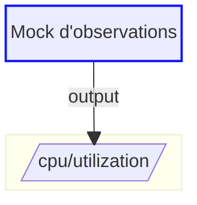

# Rédaction des slides en Markdown

Date : 2026-09-03
Statut : design validé, prêt pour plan d'implémentation

## Problème

Les slides s'écrivent en HTML brut. `impact-framework/demoit.html` fait 740 lignes pour 18 slides, dont :

- le même `<header><nav>` de 13 lignes (titre + 2 logos + classes beercss) recopié sur 17 slides sur 18 ;
- les wrappers `<main class="responsive max">`, les `<div class="large-space">` d'espacement manuel, les `<div class="s12 m6 l6">` de grille ;
- deux mécanismes de mise en page concurrents pour les slides de démo : `<split-view>` (colonnes égales) et `<div class="grid"><div class="s4">` (colonnes pondérées) ;
- un contrat de composant piégeux pour `<source-code>` (voir « Traduction des séparateurs »).

Écrire une slide coûte donc du temps de plomberie HTML, pas du temps de contenu.

Objectif : rédiger le contenu en Markdown, avec une syntaxe qui reste simple, sans perdre aucune capacité du socle Go ni des composants web.

## Décisions

| # | Décision | Motif |
|---|---|---|
| 1 | Rendu Markdown **pur Go / goldmark**, côté serveur | Aucune toolchain Node. `go build` reste hors-ligne (deps vendorées), `docker buildx bake` inchangé, `/pdf` (chromedp) et livereload continuent de fonctionner, chroma déjà vendoré est réutilisé |
| 2 | Layouts = templates Go HTML **embarqués et tous surchargeables** | Nouveau talk = un seul `.md`, mais aucun layout verrouillé dans le binaire |
| 3 | Composants via **directives** `:::nom{attrs}` (conteneur) et `::nom{attrs}` (feuille) | Convention remark-directive / MyST ; une seule syntaxe pour prose et composants, imbrication propre |
| 4 | **Coexistence** `.md` / `.html` par locale ; converti : `impact-framework/demoit.html` seulement | `demoit-en.html` reste servi en HTML, ce qui teste réellement la résolution du deck ; `sample/` non touché |
| 5 | Identité du talk dans **`.demoit/talk.yml`** | `demoit.md` et `demoit-en.html` partagent logos et palette : déclarés une seule fois |
| 6 | Séparateur `:::speakernotes`, clé `speakernotes:` | Éviter la confusion avec des annotations ; aligné sur l'élément `<speaker-notes>` et la route `/speakernotes` |

## Architecture

### Point d'accroche unique

`readSteps(folder)` (`handlers/step.go:89`) est le seul lecteur de deck du repo. Consommateurs :

- `Step` — `handlers/step.go:56`
- `LastStep` — `handlers/step.go:80`
- `Grid` — `handlers/grid.go:40`
- `ExportToPDF` — `handlers/pdf.go:145`
- `VerifyConfiguration` — `handlers/step.go:138`

Tous ne consomment que `[]Page` et son champ `.HTML`. Conséquence : tout le pipeline Markdown se branche derrière `readSteps`, et **gardent un comportement inchangé** : `/grid`, `/pdf`, `/speakernotes`, livereload, `/sourceCode`, `/shell`, `/tty`, `/beta/vscode`, `handlers/resources/index.tmpl.html`, et les `.demoit/js/demoit.js` des deux talks — le serveur continue d'émettre exactement les mêmes éléments custom.

Seul `handlers/code.go` est retouché, sans changement de comportement : ses helpers chroma sont déplacés dans `highlight/` pour être partagés avec `deck` (voir « Dépendances »).

### Nouveau package `deck/`

À la racine, en-tête Apache-2.0 comme le reste du moteur.

```
deck/
  deck.go         Load(folder, locale) ([]Slide, error)
  resolve.go      demoit-<loc>.md > demoit.md > demoit-<loc>.html > demoit.html
  split.go        découpage en slides (fence-aware) + extraction frontmatter
  talk.go         lecture .demoit/talk.yml
  layout.go       résolution layout (.demoit/layouts/ puis embed) + exécution
  layouts/*.html  layouts embarqués (go:embed)
  directive/
    parser.go     block parser goldmark : ouverture, continuation, clôture des fences
    node.go       nœud AST Directive (nom, attributs, longueur de fence)
    transform.go  ASTTransformer : enveloppe les enfants de :::split{cols} en <div class="sN">
    render.go     renderer : nom de directive -> élément custom + traduction d'attributs
  render.go       assemblage goldmark (directives + fences mermaid / chroma)

highlight/
  highlight.go    lexer / style / lexer YAML, extraits de handlers/code.go
```

Fichiers existants modifiés : `handlers/step.go` (appelle `deck.Load`), `handlers/code.go` (consomme `highlight/`), `go.mod` + `vendor/`.

`handlers/step.go` se réduit à appeler `deck.Load` puis à mapper vers `Page`.

Motif de la séparation : `handlers/` mélange déjà HTTP et métier sur 11 fichiers ; le rendu de deck n'a aucune raison d'importer `net/http`. Effet utile : `deck.Load` est testable sans serveur — ce sera le premier code testable du repo.

### Pipeline

```
demoit.md
  -> split.go      : slices de slides + frontmatter YAML + offset de ligne
  -> render.go     : goldmark(directives, mermaid, chroma) -> Slide.Content
  -> layout.go     : template Go du layout            -> Page.HTML
  -> handlers      : index.tmpl.html                  -> réponse HTTP
```

Deux étages de template. `Page` garde tous ses champs actuels.

### Dépendances

| Dep | Version | Motif |
|---|---|---|
| `github.com/yuin/goldmark` | **v1.7.8** | v1.8.6 déclare `go 1.22`, alors que `go.mod` déclare `go 1.19` et que `Dockerfile:9` épingle `golang:1.19.3-alpine3.16` — l'image utilisée par `docker/bake-action` en CI (`.github/workflows/binaries.yml:14`). v1.7.8 déclare `go 1.19` : zéro bump, CI intacte. Aucune dépendance transitive |
| `gopkg.in/yaml.v3` | v3.0.1 | frontmatter + `talk.yml`. Seule dépendance : `check.v1`, de test |

Puis `go mod vendor` (nécessite le réseau une fois ; vérifié disponible).

**Pas de lib de directives.** `github.com/stefanfritsch/goldmark-fences` v1.0.0 (388 lignes) est la seule extension `:::` en Go, et elle est inutilisable ici : son `Open()` refuse d'ouvrir un fence sans accolade —

> `// If there are no attributes we can't create a div because we won't know if a ":::" ends the last fenced container or opens a new one`

— elle lit donc `:::{.classe}` mais pas `:::split{height=xlarge}` (nom nu), la syntaxe retenue. On écrit le parseur (~300 lignes) sur son modèle, qui est sain : block parser goldmark, pile de nesting dans `parser.Context`, réutilisation de `parser.ParseAttributes` de goldmark pour le `{...}`.

**Pas de `goldmark-highlighting`.** chroma v2.3.0 est déjà vendoré et `handlers/code.go` a déjà lexer + style + formatter câblés (`lexer()` ligne 105, `style()` ligne 118, `nonDefaultYAMLLexer` ligne 70). Le renderer de fence réutilise ce code : un seul thème de coloration dans tout le talk, zéro dépendance de plus.

Ces trois helpers sont aujourd'hui non exportés dans `handlers`, et `deck` ne peut pas importer `handlers` — `handlers` importera `deck`, ce serait un cycle. Ils sont donc extraits dans un nouveau package racine **`highlight/`**, aux côtés de `files/` et `flags/`, consommé par `handlers/code.go` et par `deck/render.go`. Un seul lexer YAML, un seul thème par défaut (`styles.GitHub`) : le rendu d'un fence ```` ```yaml ```` et celui de `/sourceCode` restent identiques.

## Format d'écriture

### Découpage des slides

Aujourd'hui `bytes.Split(content, []byte("---"))` n'est pas ancré en début de ligne. C'est pourquoi les commentaires HTML doivent écrire `-&#45;&#45;` (`impact-framework/demoit.html:88`).

Nouveau scanner, ligne à ligne :

1. il suit l'ouverture et la fermeture des fences ```` ``` ```` et `~~~` (longueur appariée) ;
2. **hors de tout fence**, une ligne `^---+\s*$` ouvre une nouvelle slide ;
3. il conserve l'offset de ligne de départ de chaque slide, pour que les messages d'erreur pointent la ligne de `demoit.md`.

Un `---` dans un bloc mermaid (mermaid a sa propre syntaxe `---`) ou dans un exemple YAML ne coupe donc plus rien.

Contrepartie assumée, à documenter : la barre de séparation Markdown `---` n'est plus disponible dans le contenu. Écrire `***` ou `___`, les deux autres formes CommonMark.

### Frontmatter par slide

Le `---` qui sépare deux slides **fait aussi office de fence ouvrante** du frontmatter de la slide suivante — c'est la forme des decks sli.dev, et c'est la seule qui évite d'écrire `---` deux fois de suite :

```markdown
---
layout: cover
---
# Première slide

---
layout: split
title: Deuxième slide
---
::term{path=sources}
```

La reconnaissance est **déterministe, sans sonde YAML** : un bloc est du frontmatter si sa première ligne est une paire `clé: valeur` dont la clé est **en minuscules** (`^[a-z][a-z0-9_-]*\s*:`), et il se termine au `---` suivant. Une prose Markdown après une rupture de slide commence par `#`, `*`, `<`, une majuscule ou une ligne vide — jamais par ça. En début de fichier, un `---` en première ligne joue le même rôle d'ouverture, si bien que la forme est identique partout.

Limite assumée, à documenter : un paragraphe qui commencerait par un mot en minuscules suivi de `:` en colonne 0, et qui serait suivi d'un `---`, serait pris pour du frontmatter — la slide s'afficherait vide. L'alternative, tenter de parser le bloc en YAML, se trompe sur n'importe quelle ligne du genre `note: attention`, ce qui est strictement pire.

Une slide sans frontmatter est du contenu pur.

| Clé | Effet |
|---|---|
| `layout` | choix du layout. Défaut : `layout` de `talk.yml`, sinon `default` |
| `title` | alimente le `<h2 class="max center-left">` du header |
| `source` | alimente la ligne `Source: …` en pied de slide |
| `class` | classes ajoutées au `<main>` (`center-align`, `middle-align`, `large-height`…) |
| `height` | classe de hauteur du conteneur de colonnes du layout `split` (`xlarge` -> `xlarge-height`) |
| `speakernotes` | équivalent YAML de `:::speakernotes`, pour une note courte |
| *toute autre clé* | exposée au layout via `{{ .Meta.<clé> }}` — pas de liste fermée, un layout custom lit ce qu'il veut sans toucher au Go |

### Catalogue des directives

Conteneur `:::nom{attrs}` … `:::`, feuille `::nom{attrs}`.

**Grammaire des attributs : `clé=valeur`, séparés par des espaces.** Une valeur non quotée court jusqu'au prochain espace ou à l'accolade fermante ; une valeur qui doit contenir un espace ou une accolade se met entre guillemets doubles. Un bloc malformé — accolade non fermée, clé sans valeur, guillemet non terminé — est une erreur localisée, jamais un abandon silencieux.

Motif du parseur maison, découvert à l'exécution : `parser.ParseAttributes` de goldmark **ne sait pas lire les valeurs dont ce catalogue a besoin**. Son scanner de valeur non quotée (`parser/attribute.go:301`) n'accepte que `[A-Za-z0-9_:.-]`, et tout ce qui commence par un chiffre part dans son parseur de nombres. Une valeur qu'il ne peut pas terminer fait échouer le bloc **entier**, ce qui dépouille la directive de tous ses attributs sans le dire :

| Valeur nécessaire | Ce que goldmark en fait |
|---|---|
| `path=sandbox` | passe |
| `src=https://if.greensoftware.foundation/users/quick-start` | s'arrête au premier `/` |
| `lines=11-20` | lit `11`, bute sur `-` |
| `files=a.yml,b.yml` | s'arrête à la virgule |
| `cols=4,8` | s'arrête à la virgule |

Quatre des six directives sont donc inutilisables avec ce parseur, dont `::browser` avec n'importe quelle URL réelle.

Les raccourcis `#id` et `.classe` de goldmark disparaissent avec lui. Rien dans le catalogue ni dans les 18 slides d'`impact-framework` ne les utilise, et une slide qui veut une classe nue redescend en HTML brut.

| Écriture Markdown | HTML émis |
|---|---|
| `:::split` … `:::` | `<split-view>` |
| `:::split{height=xlarge}` … `:::` | `<split-view class="xlarge-height">` |
| `:::split{cols=4,8 height=xlarge}` … `:::` | `<div class="grid xlarge-height"><div class="s4">…</div><div class="s8">…</div></div>` |
| `::term{path=sandbox}` | `<web-term path="sandbox"></web-term>` |
| `::browser{src=https://…}` | `<web-browser src="https://…"></web-browser>` |
| `::code{folder=sources files=pipelines.yml lines=11-20}` | `<source-code folder="sources" files="pipelines.yml" start-lines="11" end-lines="20" code_style="vs"></source-code>` |
| `::vscode{path=sources}` | `<vs-code path="sources"></vs-code>` |
| `:::window{title="mon titre"}` … `:::` | `<fake-window title="mon titre">` |
| `:::speakernotes` … `:::` | `<speaker-notes>` (contenu rendu en Markdown) |
| ```` ```mermaid ```` … ```` ``` ```` | `<pre class="mermaid">` |
| ```` ```yaml ```` … ```` ``` ```` | HTML chroma, via le code de `handlers/code.go` |

Le contenu d'un conteneur est parsé comme du Markdown normal. Voir « Imbrication » pour la gestion de l'indentation et des conteneurs imbriqués.

Une directive inconnue est une erreur localisée (voir « Gestion d'erreurs »), jamais un passage silencieux en HTML.

### Colonnes égales ou pondérées, une seule directive

Le deck actuel utilise deux mécanismes concurrents :

- `<split-view class="xlarge-height">` — colonnes égales, CSS grid `auto-fit` (`demoit.js:472-488`), 3 slides ;
- `<div class="grid xlarge-height"><div class="s4">…</div><div class="s8">…</div></div>` — colonnes pondérées beercss, pour `web-term` étroit + `vs-code` large (`demoit.html:541-551`).

`:::split` unifie les deux : sans `cols`, il émet `<split-view>` ; avec `cols=4,8`, il émet la grille beercss et enveloppe chaque enfant direct dans son `<div class="sN">`. Le nombre de valeurs de `cols` doit égaler le nombre d'enfants directs, sinon erreur localisée.

### Layout `split` et directive `:::split` : qui porte le conteneur

Les deux produisent un conteneur de colonnes ; sans règle, une slide qui déclare `layout: split` **et** écrit `:::split` dans son corps en obtiendrait deux, imbriqués.

Partage des rôles :

- **`layout: split`** enveloppe `Content` dans un `<split-view class="{height}-height">`, donc **colonnes égales uniquement**. C'est le cas des 3 slides `<split-view>` du deck actuel : un seul split occupant toute la slide.
- **`:::split{cols=4,8}`** est la seule voie pour des **colonnes pondérées**. Motif technique : pondérer exige d'envelopper chaque enfant dans son `<div class="sN">`, ce qui n'est possible qu'en connaissant les frontières entre enfants — information disponible dans l'AST Markdown, mais perdue une fois `Content` rendu en HTML pour le layout. La directive est donc utilisée dans une slide `bare` ou `default`.
- La directive sert aussi les cas que le layout ne couvre pas : plusieurs splits dans une même slide, ou un split imbriqué dans un `:::window`.

Écrire `:::split` dans une slide `layout: split` est une erreur localisée — le message indique laquelle des deux formes retirer.

Le template `split` embarqué est :

```
{{ template "header" . }}
<main class="responsive max {{ .Class }}">
  <split-view class="{{ .Height }}-height">{{ .Content }}</split-view>
</main>
{{ with .Notes }}<speaker-notes>{{ . }}</speaker-notes>{{ end }}
```

### Imbrication : pile de conteneurs, seul le plus profond se ferme

goldmark appelle `Continue` sur les blocs ouverts **du plus externe au plus interne** (`parser/parser.go:1081-1094`, boucle `for i := 0; i < l; i++`). Naïvement, une ligne `:::` fermante atteindrait donc le conteneur externe en premier et le refermerait avec tous ses descendants.

Le parseur maintient une pile de conteneurs ouverts dans `parser.Context`, et applique la règle : **seul le conteneur le plus profond de la pile consomme une fence fermante**. Un conteneur externe qui voit une fence fermante alors qu'il n'est pas le plus profond retourne `Continue | HasChildren` et laisse la ligne à son enfant.

Conséquence pour la rédaction : **l'imbrication ne demande aucune gymnastique de longueur de fence**, `:::` partout fonctionne.

```markdown
:::window{title="Terminal"}
:::split{cols=4,8}
::term{path=sources}
::vscode{path=sources}
:::
:::
```

Une fence fermante doit être au moins aussi longue que l'ouverture du conteneur qu'elle ferme, ce qui laisse `::::` disponible pour lever une ambiguïté à la main si besoin.

La pile porte aussi l'indentation de contenu : la première ligne de contenu non vide d'un conteneur fixe son indentation, retirée de toutes les lignes suivantes. Sans cela, une imbrication indentée de 2 espaces par niveau atteindrait 4 espaces en profondeur 2 et basculerait en bloc de code Markdown.

Un conteneur encore sur la pile en fin de fichier n'a jamais été fermé : erreur localisée pointant la ligne de son ouverture.

### Traduction des séparateurs de `source-code`

Contrat réel du composant, lu dans `demoit.js:274-276` et `handlers/code.go:129-130` :

- `files` : séparé par des **espaces** — `getAttribute('files').split(' ')` ;
- `start-lines` / `end-lines` : séparés par des **points-virgules**, un champ par fichier — `.split(';')` ;
- dans chaque champ, plusieurs plages surlignées séparées par des **virgules** — `strings.Split(r.FormValue("startLine"), ",")`.

Trois séparateurs différents à retenir. Pire : `getAttribute('start-lines').split(';')` lève une exception si l'attribut est absent, donc un `<source-code>` sans `start-lines` casse la slide.

La directive n'expose qu'un séparateur, la virgule :

```
::code{folder=sources files=a.yml,b.yml lines=11-20,4-9}
```

Le renderer produit `files="a.yml b.yml"`, `start-lines="11;4"`, `end-lines="20;9"`. Sans `lines`, il émet quand même `start-lines=""` et `end-lines=""` : plus de crash. Sans `code_style`, il émet `code_style="vs"`, la valeur par défaut du composant (`demoit.js:267-269`).

À corriger dans la documentation du composant : `start-lines` / `end-lines` **ne tronquent pas** le fichier, elles le **surlignent** (`html.HighlightLines`, `handlers/code.go:53`). Le fichier entier est toujours affiché.

### Échappatoire HTML

goldmark est configuré avec `html.WithUnsafe()` : le HTML brut passe tel quel. N'importe quelle slide peut redescendre en HTML pur pour un cas exotique, et la migration peut se faire slide par slide.

Sans enjeu de sécurité dans ce contexte : le contenu est un fichier local du présentateur, jamais une entrée utilisateur, et le serveur écoute par défaut sur localhost.

### Exemple

`impact-framework/demoit.html:393-447`, 55 lignes de HTML, devient :

````markdown
---
layout: split
title: IF - Fonctionnement des pipelines
height: xlarge
---



::code{folder=sources files=pipelines.yml lines=11-20}
````

~20 lignes, dont 13 sont le diagramme mermaid inchangé. Header, logos, `<main>` et `<split-view>` viennent du layout `split`.

## Layouts

### Jeu embarqué

Extraits du HTML réel d'`impact-framework`, pas inventés. Répartition mesurée sur les 18 slides :

Répartition **mesurée** sur les 18 slides d'`impact-framework/demoit.html` — c'est aussi la carte de migration :

| Layout | Extrait de | Slides |
|---|---|---|
| `cover` | slide 0 : `<main class="responsive max center-align title">`, h1 + h3 + grille de 2 logos, pas de header | 0 |
| `default` | header + `<main class="main responsive large-height center-align">` + ligne `Source:` | 1, 4, 5, 6, 7, 16, 17 |
| `quote` | header + `<main>` + `<blockquote>` + ligne `Source:` | 2, 3 |
| `split` | header + `<main class="responsive max">` + `<split-view class="{height}-height">` | 8, 9, 10 |
| `content` | header + `<main class="responsive max {class}">`, sans conteneur de colonnes | 11, 12, 13, 14, 15 |
| `bare` | aucun header, `<main>` nu | échappatoire / plein écran |

`content` existe parce que les 5 slides à colonnes pondérées ont besoin du `<main class="responsive max">` de `split` mais pas de son `<split-view>` : elles portent leur grille dans le corps, via `:::split{cols=4,8}`. `default` ne convient pas — son `<main>` est celui des slides de prose.

Les slides 1, 4, 7, 8, 10, 11, 12 et 13 portent des `<speaker-notes>` ; les slides 1, 2, 3 et 4 portent une ligne `Source:`. Chaque layout doit donc émettre les deux, y compris vides.

### Résolution et surcharge

```
<talk>/.demoit/layouts/<nom>.html   -> gagne toujours
deck/layouts/<nom>.html             -> embarqué, secours
```

Aucun nom réservé, aucun layout verrouillé : `.demoit/layouts/cover.html` remplace le `cover` embarqué ; `.demoit/layouts/demo-3-panneaux.html` ajoute un layout que le moteur ne connaît pas. Un `layout:` introuvable dans les deux emplacements est une erreur localisée, pas un crash.

### Contrat exposé aux templates

Interface publique, elle doit rester stable — les talks écrivent des layouts contre elle.

```go
type Talk struct {
    Title  string
    Layout string
    Logos  []string
    Footer string
}

type Slide struct {
    Talk    Talk
    Title   string
    Source  string
    Class   string
    Height  string
    Content template.HTML
    Notes   template.HTML
    Meta    map[string]any
}
```

`:::speakernotes` rend `<speaker-notes>` **en place dans `Content`** : `demoit.js:609` fait un `getElementsByTagName("speaker-notes")`, la position dans la page est indifférente. La clé `speakernotes:` du frontmatter passe par le layout :

```
{{ with .Notes }}<speaker-notes>{{ . }}</speaker-notes>{{ end }}
```

Les deux voies doivent continuer d'émettre, y compris vides, pour ne pas désynchroniser la fenêtre de notes (`BroadcastChannel("demoit_nav")`).

### `.demoit/talk.yml`

Lu une fois par talk, partagé par `demoit.md` et `demoit-en.html`.

```yaml
title: A la découverte d'Impact Framework
layout: default
logos: [/images/zatsit_logo.svg, /images/logo.jpg]
footer: Slides framework adapted from demoit
```

Absent : valeurs par défaut, aucun logo. Un talk peut donc démarrer avec un seul `.md`.

## Résolution du deck

`deck.Load(folder, locale)` cherche dans l'ordre :

1. `demoit-<locale>.md`
2. `demoit.md`
3. `demoit-<locale>.html`
4. `demoit.html`

Le premier trouvé gagne. `locale` vient du flag `--locale` ; vide, les entrées 1 et 3 sont ignorées.

Un deck `.html` est traité comme aujourd'hui : découpage sur `---` et injection brute, sans goldmark, sans layout, sans frontmatter. Le comportement des talks non migrés est donc strictement inchangé.

Après migration, `impact-framework` sert `demoit.md` en français et `demoit-en.html` en anglais — les deux formats cohabitent dans le même talk, ce qui exerce réellement cette résolution.

## Gestion d'erreurs

Aujourd'hui, toute erreur de `readSteps` donne un 500 en texte brut. Acceptable au démarrage, invivable pendant la rédaction : une accolade oubliée en `--dev` ferait perdre l'écran entier.

**Erreur localisée à une slide** — YAML de frontmatter invalide, `layout:` inconnu, `:::` non fermé, directive inconnue, `cols` incohérent avec le nombre d'enfants, `:::split` dans une slide `layout: split`. La slide affiche un bloc d'erreur lisible portant le fichier, le numéro de ligne dans le source et le message ; les autres slides rendent normalement. Le nombre de slides est préservé, donc la navigation, `/grid` et `/pdf` restent cohérents.

**Erreur globale** — deck introuvable, `talk.yml` illisible, layout embarqué corrompu. 500 comme aujourd'hui, et `VerifyConfiguration` refuse le démarrage.

## Vérification

Le repo n'a aucun test Go. `deck` est du code pur (entrée : fichiers, sortie : HTML) — l'endroit naturel pour en introduire, en golden files : `deck/testdata/<cas>.md` + `deck/testdata/<cas>.golden.html`.

Cas obligatoires :

- `---` à l'intérieur d'un fence mermaid et d'un fence YAML : ne coupe pas ;
- slide avec frontmatter, slide sans, et **frontmatter sur une slide autre que la première** ;
- prose commençant par `Note: attention` (majuscule) : reste du contenu ;
- prose commençant par `note: attention` (minuscule) suivie d'un `---` : prise pour du frontmatter, limite documentée et épinglée ;
- chaque directive du catalogue ;
- `:::split` sans `cols`, avec `cols`, avec `cols` incohérent ;
- `layout: split` avec `height`, et `:::split` dans une slide `layout: split` (erreur) ;
- `:::split` dans une slide `layout: default` ;
- imbrication `:::window` > `:::split` en fences de même longueur, et sur 3 niveaux ;
- conteneur non fermé en fin de fichier : erreur pointant la ligne d'ouverture ;
- contenu de conteneur indenté de 2 espaces par niveau sur 2 niveaux : ne bascule pas en bloc de code ;
- imbrication `:::split` > ```` ```mermaid ```` ;
- `::code` sans `lines`, avec plusieurs fichiers, avec plusieurs plages ;
- HTML brut inline ;
- chaque cas d'erreur localisée ;
- résolution du deck : `.md` gagne sur `.html`, locale gagne sur défaut ;
- surcharge de layout par `.demoit/layouts/`.

Vérification bout en bout, manuelle et non contournable : `demoit --dev impact-framework`, puis `/grid` qui affiche les 18 slides en iframes côte à côte, comparé au rendu du `demoit.html` conservé dans git. **Critère de réussite : rendu identique slide par slide.**

Plus `gofmt -l .` et `golangci-lint run -c golangci.yml`.

## Hors périmètre

- MDX, JSX, props JS, expressions JavaScript dans les slides.
- Directives inline (`:nom[texte]{attrs}`) — bloc uniquement.
- Conversion de `impact-framework/demoit-en.html` et de `sample/demoit.html`.
- Modification de `.demoit/js/demoit.js` ou de `.demoit/style.css`, dans l'un ou l'autre talk.
- Bump de la version Go dans `go.mod` ou dans le `Dockerfile`.
- Ajout de nouveaux composants web ; le catalogue de directives couvre l'existant.
