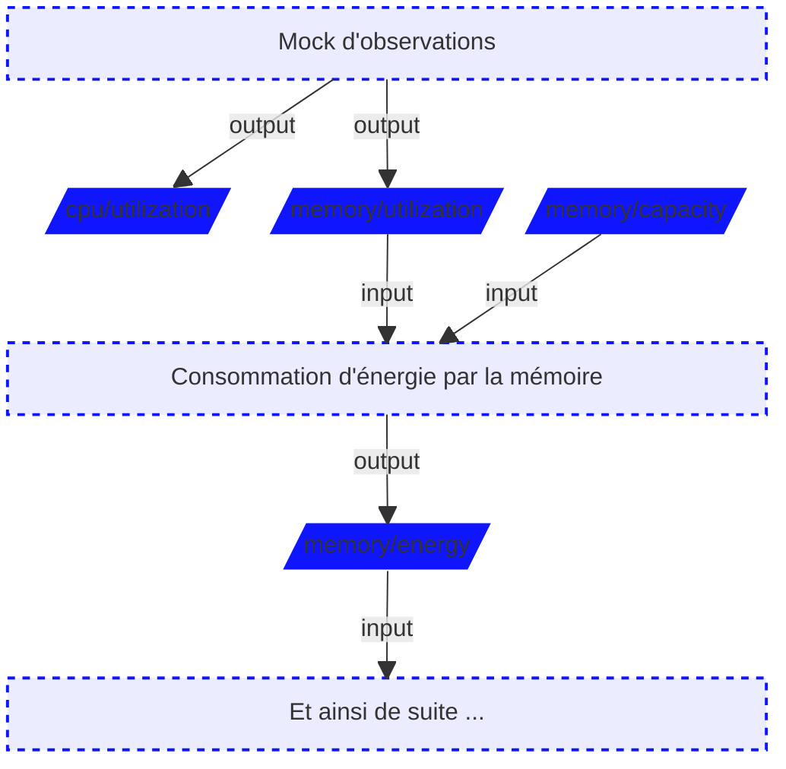

<h1 class=" medium no-padding center-align top-align" style="color: white">A la découverte d'Impact Framework.</h1>
<h3 style="color: white">10 Avril 2025</h3>

---
title: L'impact du numérique
source: https://www.arcep.fr/la-regulation/grands-dossiers-thematiques-transverses/lempreinte-environnementale-du-numerique.html
speakernotes: |
  ADEME: Agence de l'environnement et de la maîtrise de l'énergie part of Agence de la Transition Ecologique
---

<!--    <h3>D'après l'ADEME,</h3>-->

## *2,5%* des émissions de gaz à effet de serre de la France sont dues au numérique.

## *10%* de l’électricité en France est consommée par le numérique.

---
layout: default
title: Et l'IA dans tout ça ?
source: https://arxiv.org/pdf/2311.16863 (Etude  Hugging Face - Octobre 2024)
class: main responsive large-height middle-align
---

<!--
<header>
    <nav>
        <h2 class="max center-left">Une empreinte plus large que les gaz à effet de serre</h2>
        

            

                
            

            

                
            

        

    </nav>
</header>
<main class="main responsive  large-height center-align middle-align">
    <blockquote>
        <h5>
            Au-delà des gaz à effet de serre et dans un pays où la consommation énergétique est relativement
            décarbonnée,
            il est également nécessaire d’élargir la question de l’empreinte environnementale du numérique <em>à
            l’ensemble du cycle de vie des réseaux</em>,
            <em>des équipements et des terminaux</em> en adoptant une approche multicritères (terres rares, eau, énergie
            primaire…) mais également <em>leur durée de vie et les conditions de leur recyclage</em>.
        </h5>
    </blockquote>
     
</main>

    Source: https://www.arcep.fr/la-regulation/grands-dossiers-thematiques-transverses/lempreinte-environnementale-du-numerique.html

-->

<blockquote style="font-size: 2.0rem;">
<h5><em>0.015</em> kWh consommé pour charger votre téléphone.</h5>
<h5><em>0.042</em> kWh consommé par <em>ChatGPT</em> pour générer 1000 textes.</h5>
<h5><em>0.080</em> kWh consommé par <em>votre TV</em> par heure de fonctionnement.</h5>
<h5><em>1.0</em> kWh consommé par <em>votre frigo</em> sur une journée.</h5>
<h5><em>2.9</em> kWh consommé par <em>Stable Diffusion</em> pour générer 1000 images.</h5>
</blockquote>
 

        <h5>👉 https://huggingface.co/spaces/genai-impact/ecologits-calculator</h5>

---
layout: default
title: Je suis **Ludovic Dussart**
class: main responsive xlarge-height center-align
---

<!--
<header>
    <nav>
        <h2 class="max center-left">Vous êtes vous déjà demandé ?</h2>
        

            

                
            

            

                
            

        

    </nav>
</header>
<main class="main responsive  large-height center-align middle-align">
    <blockquote>
        <h5>
            Comeibne ca représenté en banane, chocolat ou en morts ?
        </h5>
    </blockquote>
     
</main>

    Source: https://www.arcep.fr/la-regulation/grands-dossiers-thematiques-transverses/lempreinte-environnementale-du-numerique.html

-->

<h4>Solutions architect <em>@zatsit</em></h4>
<h4><em>AsyncAPI</em> maintainer</h4>
<h4>Open Source <em>fanatic</em></h4>

<h2 class="left-align"><em>Où me trouver ?</em></h2>

<h5>@ldussart</h5>

<h5>ldussart.bsky.social</h5>

<h5>Ludovic Dussart</h5>

<h2 class="left-align"><em>Où nous trouver ?</em></h2>

<h5>https://zatsit.fr</h5>

<h5>zatsit.bsky.social</h5>

<h5>https://blog.zatsit.fr</h5>

<h6>« Engager notre <em>expertise numérique</em> au service de <em>l'impact des entreprises</em>, en créant un écosystème <em>durable</em>, <em>partenarial</em> et <em>positif</em> »</h6>

---
layout: default-h3
title: Quels outils pour la mesure d'empreinte environnementale dans le digital ?
source: https://github.com/Green-Software-Foundation/awesome-green-software
class: main responsive large-height center-align middle-align
speakernotes: |
  une panoplie d'outils par catégorie mais comment aggreger tout ça ?
---

<table class="border small-space xlarge-text">
<tr>
<th>Code based</th>
<td>codecarbon.io</td>
<td>JoularJX</td>
<td>ecoCode</td>
<td>etc</td>
</tr>
<tr>
<th>Web</th>
<td>ecoIndex</td>
<td>EcoGrader</td>
<td>Website Carbon Calculator</td>
<td>GreenIT-Analysis</td>
<td>etc</td>
</tr>
<tr>
<th>Infra / Hardware</th>
<td>Kepler</td>
<td>Scaphandre</td>
<td>PowerJoular</td>
<td>CO2 Scope</td>
<td>etc</td>
</tr>
<tr>
<th>Cloud based</th>
<td>Cloud Carbon Footprint</td>
<td>Customer Carbon Footprint Tool for AWS</td>
<td>Microsoft Emissions Impact Dashboard</td>
<td>Carbon Footprint</td>
<td>OVHcloud Carbon Calculator</td>
<td>etc</td>
</tr>
<tr>
<th>AI</th>
<td>carbontracker</td>
<td>Experiment Impact Tracker Library</td>
</tr>
</table>

---
layout: content
title: On en construit des référentiels chez **zatsit**
class: main responsive max xlarge-height
---

<a class="large-text small center large-space" href="https://github.com/zatsit-oss/awesome-impact-tools"
target="_blank"><em><strong>zatsit</strong> OSS awesome-impact-tools</em></a></h6>

<a class="large-text small center large-space" href="https://sustainability.zatsit.fr/landscape/?group=all&view-mode=grid"
target="_blank"><em><strong>zatsit</strong> sustainability landscape</em></a>
<web-browser src="https://sustainability-ldscp.zatsit.fr/?view-mode=grid"></web-browser>

---
layout: content
title: Et on s'est intéressé à **Impact Framework**
class: main responsive max large-height
---

<h3>La mesure d'impact des logiciels doit s'appuyer sur des <em>standards</em> et des <em>outils</em>
</h3>

---
layout: content
title: Motivations
class: main responsive max large-height center-align
speakernotes: |
  La mesure de l'impact des logiciels sur des paramètres tels que le carbone, l'eau et l'énergie est
  complexe et nuancée.
    
  Les applications modernes sont composées de nombreux éléments logiciels plus petits (composants)
  fonctionnant sur différents environnements, par exemple, cloud privé, cloud public, bare-metal, virtualisé,
  conteneurisé, mobile, ordinateurs portables, ordinateurs de bureau, embarqué et IoT.
    
  Transformer des observations en impacts: Les mesures facilement observables telles que l'utilisation de l'unité
  centrale, les pages vues et les installations sont converties en impacts environnementaux tels que les émissions de
  carbone, l'utilisation de l'eau, la consommation d'énergie et la qualité de l'air.  
  Explorer les scénarios de simulation: Découvrez l'impact environnemental des changements apportés à votre logiciel
  en temps réel en examinant comment la performance environnementale de votre logiciel évolue si votre application est
  déplacée vers le nuage ou si son temps d'exécution est modifié.  
  Stockez:
  Enregistrez vos observations, les plugins choisis, les configurations et les impacts environnementaux calculés dans
  un fichier manifeste. Ouvrez la porte à d'autres personnes pour qu'elles comprennent, vérifient et remettent en
  question l'ensemble du processus.
  Permettez à d'autres personnes de réexécuter votre fichier manifeste, de valider vos résultats ou de remettre en
  question vos hypothèses. Ils peuvent modifier les configurations, sélectionner différents plugins et effectuer
  eux-mêmes l'analyse.
---

<h3>Impact Framework (IF) vise à faciliter le <em>calcul</em> et le <em>partage</em> des impacts
environnementaux des logiciels.</h3>

<h3 class="left-align">Les promesses du framework ?</h3>

<h4 class="left-align"><em>Transformez</em> vos observations en unités d'impacts.</h4>
<h4 class="left-align"><em>Explorez</em> des scénarios de simulation.</h4>
<h4 class="left-align"><em>Stockez</em> vos manifestes et <em>démocratisez-</em>les.</h4>

---
layout: split
title: IF - Concepts majeurs
height: xlarge
speakernotes: |
  - D'abord présenter if-run
  - Ensuite montrer le manifest
---

::browser{src=https://if.greensoftware.foundation/major-concepts/if}

---
layout: split
title: IF - Fonctionnement des pipelines
height: xlarge
---

::code{folder=sources files=pipelines.yml lines=11-20}

---
layout: split
title: IF - Hello World !
height: xlarge
speakernotes: |
  - montrer if-run --help
  - energy : kwH
---

::term{path=sandbox}

::browser{src=https://if.greensoftware.foundation/users/quick-start}

---
layout: content
title: IF - Observer.
speakernotes: |
  - montrer if-run --help
  - energy : kwH
  - carbon : eqCo2
---

:::grid{class="grid xlarge-height"}
:::col{class="s12"}
#### Pour pouvoir commencer à *mesurer*, il faut d'abord *observer* et *récolter* de la data.
:::

:::col{class="s4 xlarge-height"}
<text>

 

Il existe quelques plugins permettant de nourrir les pipelines en <em>inputs
:</em>

<ul class="xlarge-text">
<li>Mock Observations</li>
<li>AWS Importer</li>
<li>Azure Importer</li>
<li>Datadog Importer</li>
<li>cloud-storage-metadata</li>
<li>prometheus-importer</li>
<li>et pleins d'autres à suivres ...</li>
</ul>

</text>
:::

:::col{class="s8 xlarge-height"}
::vscode{path=sources}

<!--        <web-browser src="https://explorer.if.greensoftware.foundation/"></web-browser>-->
:::
:::

---
layout: content
title: IF - Observer
speakernotes: |
  - montrer group
  - puis cloud-metadata
---

:::split{cols=4,8 height=xlarge}
::term{path=sources}

::vscode{path=sources}
:::

---
layout: content
title: IF - C'est quoi la consommation energétique de zatsit.fr ?
class: responsive max xlarge-height
---

<!--
<header>
    <nav>
        <h5 class="max center-left">IF - Calculer.</h5>
        

            

                
            

            

                
            

        

    </nav>
</header>
<main class="responsive max xlarge-height">
    <text>
        <h5>Cela consiste à <em>assembler</em> les plugins pour obtenir des <em>outputs</em> de type
            <em>mesures</em>.</h5>
         
    </text>
    <split-view class="large-height">
        
        &lt;!&ndash;            &ndash;&gt;
        <web-browser src="https://explorer.if.greensoftware.foundation/"></web-browser>
    </split-view>
    <speaker-notes>
        - montrer if-run &#45;&#45;help
        - energy : kwH
        - carbon : eqCo2
    </speaker-notes>
</main>
-->

:::split{cols=4,8 height=xlarge}
::term{path=sources}

::vscode{path=sources}
:::

---
layout: content
title: IF - Visuellement, c'est mieux.
class: responsive max xlarge-height
---

:::split{cols=4,8 height=xlarge}
::term{path=sources}

::vscode{path=sources}
:::

---
layout: content
title: IF - Visuellement, c'est mieux.
class: responsive max xlarge-height
---

:::split{cols=4,8 height=xlarge}
::term{path=sources}

::browser{src=http://localhost:3000}
:::

---
layout: content
title: IF - C'est quoi la suite ?
class: main responsive max large-height center-align
---

<h3>Imaginez la configuration des pipelines Impact Framework (IF) en WYSIWYG ?</h3>

<h4 class="left-align"><em>Essayez</em> le framework.</h4>
<h4 class="left-align"><em>Contribuer</em> et faire évoluer l'existant.</h4>
<h4 class="left-align"><em>Proposez</em> de nouveaux plugins ?</h4>
<h4 class="left-align"><em>Constituez</em> vos propres manifests.</h4>

---
layout: default
title: Merci de votre attention. Des questions ?
class: main responsive xlarge-height center-align
---

<h2 class="left-align"><em>Où me trouver ?</em></h2>

<h5>@ldussart</h5>

<h5>ldussart.bsky.social</h5>

<h5>Ludovic Dussart</h5>

<h2 class="left-align"><em>Où nous trouver ?</em></h2>

<h5>https://zatsit.fr</h5>

<h5>zatsit.bsky.social</h5>

<h5>https://blog.zatsit.fr</h5>

